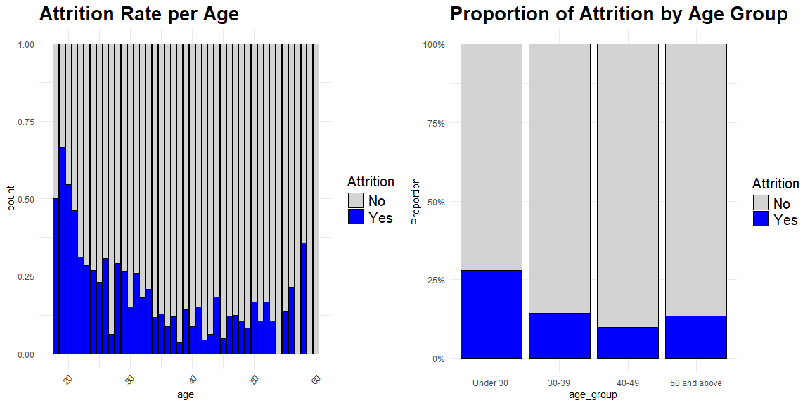
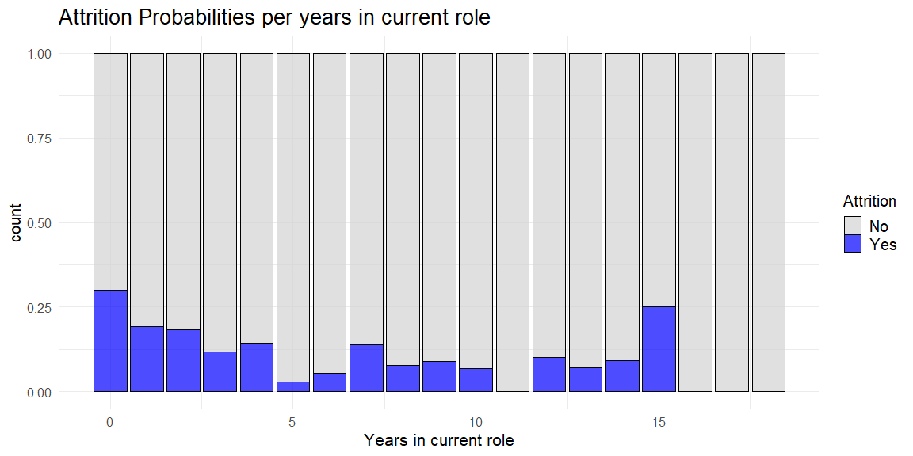
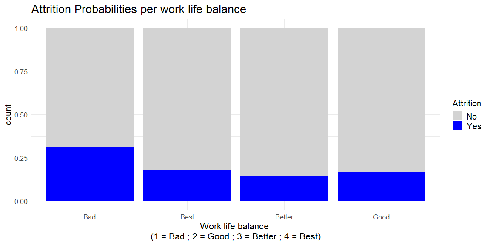

HR data analysis project
================
quanggiang169
2024-10-28

# Employee Retention Analytics: Uncovering the Factors Behind Attrition

<!-- Objective section to explain the aim of the project -->

<div style="margin-top: -10px; font-weight: normal; font-size: 20px;">

Objective: Analyze HR data to understand the factors influencing
employee attrition.

</div>

<!-- Horizontal line to separate sections -->
<hr>

## 1. Understanding the context and the problem

### 1.1. Understanding Attrition in the Workplace

**Attrition** refers to the gradual reduction of a company’s workforce
due to voluntary employee departures, such as resignations, retirements,
or other forms of separation where roles are not immediately filled.
Unlike turnover, which includes both voluntary and involuntary exits,
attrition typically highlights employees’ personal decisions to leave,
often for new opportunities or lifestyle changes.

Attrition is a natural part of an organization’s lifecycle, but high
attrition rates can signal deeper issues and create significant
challenges. Managing attrition is crucial for several reasons:

- **Organizational Continuity**: Each departure affects the flow of
  knowledge, skills, and experience within the company. Frequent
  attrition disrupts team dynamics, lowers continuity, and may delay
  projects as new hires get up to speed.
- **Financial Impact**: High attrition incurs substantial costs,
  including expenses for recruiting, onboarding, and training new
  employees, which can be as high as 30% to 50% of a departing
  employee’s annual salary.
- **Employee Morale and Productivity**: High attrition often places
  extra pressure on remaining staff, who must compensate for the loss.
  This can lead to employee burnout, reduced morale, and, ultimately, a
  drop in productivity, affecting team performance and the company’s
  overall efficiency.

In recent years, attrition rates have reached new highs. For example,
according to the U.S. Bureau of Labor Statistics, voluntary departures
accounted for 67% of separations in 2021—a significant increase driven
by evolving employee priorities, heightened by the pandemic. This trend,
known as the “Great Attrition,” underscores the urgent need for
companies to understand why employees leave and to implement strategies
that foster retention, engagement, and a positive work environment.

**References**

- [The Great Attrition: Facing the labor shortage conundrum - McKinsey &
  Company](https://www.mckinsey.com/capabilities/people-and-organizational-performance/our-insights/the-organization-blog/the-great-attrition-facing-the-labor-shortage-conundrum)

- [Employee Attrition: Meaning, Impact & Attrition Rate Calculation-
  AIHR](https://www.aihr.com/blog/employee-attrition/)

- [Attrition: Definition, Types, Causes & Mitigation Tips-
  SHRM](https://www.shrm.org/in/topics-tools/news/employee-relations/attrition-definition-types-causes-mitigation-tips)

### 1.2. Project Objective

The primary aim of this project is to analyze employee attrition data to
uncover the key factors influencing employees’ decisions to leave.
Through Exploratory Data Analysis (EDA), I hope to identify patterns and
insights that reveal which characteristics, such as age, job position,
experience, salary, or company culture, most strongly impact employee
attrition.

Key questions guiding this analysis include:

- Are certain groups of employees more likely to leave than others?
- What characteristics are commonly found among employees who decide to
  leave?
- Which factors can be managed or improved to help reduce attrition
  rates?

By answering these questions, the EDA aims to provide actionable
insights that can inform strategies to enhance employee retention and
foster a more stable workforce.

## 2. Load libraries

``` r
library(tidyverse)
```

    ## ── Attaching core tidyverse packages ──────────────────────── tidyverse 2.0.0 ──
    ## ✔ dplyr     1.1.4     ✔ readr     2.1.5
    ## ✔ forcats   1.0.0     ✔ stringr   1.5.1
    ## ✔ ggplot2   3.5.1     ✔ tibble    3.2.1
    ## ✔ lubridate 1.9.3     ✔ tidyr     1.3.1
    ## ✔ purrr     1.0.2     
    ## ── Conflicts ────────────────────────────────────────── tidyverse_conflicts() ──
    ## ✖ dplyr::filter() masks stats::filter()
    ## ✖ dplyr::lag()    masks stats::lag()
    ## ℹ Use the conflicted package (<http://conflicted.r-lib.org/>) to force all conflicts to become errors

``` r
library(moments)
library(janitor)
```

    ## 
    ## Attaching package: 'janitor'
    ## 
    ## The following objects are masked from 'package:stats':
    ## 
    ##     chisq.test, fisher.test

``` r
library(knitr)
library(gridExtra)
```

    ## 
    ## Attaching package: 'gridExtra'
    ## 
    ## The following object is masked from 'package:dplyr':
    ## 
    ##     combine

``` r
library(ggcorrplot)
```

    ## Warning: package 'ggcorrplot' was built under R version 4.4.2

``` r
library(reshape2)
```

    ## Warning: package 'reshape2' was built under R version 4.4.2

    ## 
    ## Attaching package: 'reshape2'
    ## 
    ## The following object is masked from 'package:tidyr':
    ## 
    ##     smiths

## 3. Checking the data set

### 3.1. Data Dictionary

The IBM HR Analytics Employee Attrition & Performance dataset is a
fictional dataset created by IBM data scientists. Since not all features
have descriptions, I have made interpretations of what they represent.

You can find the dataset
[here](https://www.kaggle.com/pavansubhasht/ibm-hr-analytics-attrition-dataset).

| Feature Name | Data Type | Description |
|----|----|----|
| Age | integer | Employee’s age in years |
| Attrition | factor | If the employee stayed or left the company (Yes ; No) |
| BusinessTravel | factor | How often the employee has business travel (Travel_Rarely ; Travel_Frequently ; Non-Travel) |
| DailyRate | integer | Employee’s daily rate in USD. |
| Department | factor | Which department the employee belongs to (Sales ; Research & Development ; Human Resources) |
| DistanceFromHome | integer | How far the employee lives from work in kilometers. |
| Education | integer | Employee’s education level (1 = Below College ; 2 = College ; 3 = Bachelor ; 4 = Master ; 5 = Doctor) |
| EducationField | factor | Employee’s education field (Life Sciences ; Medical ; Marketing ; Technical Degree, Human Resources ; Other) |
| EmployeeCount | integer | How many employees the current record represents. |
| EmployeeNumber | integer | Employee’s unique identification number |
| EnvironmentSatisfaction | integer | How satisfied the employee is with the company’s environment (1 = Low ; 2 = Medium ; 3 = High ; 4 = Very High) |
| Gender | factor | Employee’s gender (Female ; Male) |
| HourlyRate | integer | Employee’s hourly rate in USD |
| JobInvolvement | integer | How involved the employee feels with his/her job (1 = Low ; 2 = Medium ; 3 = High ; 4 = Very High) |
| JobLevel | integer | Employee’s job level (1 = Junior ; 2 = Mid ; 3 = Senior ; 4 = Manager ; 5 = Director) |
| JobRole | factor | Employee’s job role (Sales Executive ; Research Scientist ; Laboratory Technician ; Manufacturing Director ; Healthcare Representative ; Manager ; Sales Representative ; Research Director ; Human Resources) |
| JobSatisfaction | integer | How satisfied the employee feels with his/her job (1 = Low ; 2 = Medium ; 3 = High ; 4 = Very High) |
| MaritalStatus | factor | Employee’s marital status (Single ; Married ; Divorced) |
| MonthlyIncome | integer | Employee’s monthly income in USD |
| MonthlyRate | integer | Employee’s monthly rate in USD |
| NumCompaniesWorked | integer | Number of companies that the employee has already worked. |
| Over18 | factor | If the employee is over 18 years old (Yes) |
| OverTime | factor | If the employee makes overtime (Yes ; No) |
| PercentSalaryHike | integer | The percentage of the amount a salary is increased |
| PerformanceRating | integer | Employee’s performance rating (1 = Low ; 2 = Good ; 3 = Excellent ; 4 = Outstanding) |
| RelationshipSatisfaction | integer | How satisfied the employee feels with the relationship with his/her manager (1 = Low ; 2 = Medium ; 3 = High ; 4 = Very High) |
| StandardHours | integer | Employee’s standard hours of work per day |
| StockOptionLevel | integer | Employee’s stock option level (refer to: What You Should Know About Option Trading Levels) |
| TotalWorkingYears | integer | Total years that the employee has professionally worked |
| TrainingTimesLastYear | integer | Total times that the employee had a training session the last year |
| WorkLifeBalance | integer | How the employee feels about his/her work-life balance (1 = Bad ; 2 = Good ; 3 = Better ; 4 = Best) |
| YearsAtCompany | integer | Total years that the employee has worked at the company |
| YearsInCurrentRole | integer | Total years that the employee has worked in his/her current job role |
| YearsSinceLastPromotion | integer | Total years since the employee had his/her last promotion at the company |
| YearsWithCurrManager | integer | Total years that the employee has worked under his/her current manager |

### 3.2. Loading data set

``` r
df_hratt <- read_csv("dataset/WA_Fn_UseC_HR_Employee_Attrition.csv", col_types = cols())
```

### 3.3. Renaming columns

``` r
df_hratt_cln <- clean_names(df_hratt)
```

### 3.4. Checking data dimensions

``` r
# Print the number of rows and columns in the data frame
cat('Number of rows:', nrow(df_hratt_cln), '\n')
```

    ## Number of rows: 1470

``` r
cat('Number of cols:', ncol(df_hratt_cln), '\n')
```

    ## Number of cols: 35

### 3.5. Checking data types

``` r
# Display the structure of the dataframe
str(df_hratt_cln)
```

    ## spc_tbl_ [1,470 × 35] (S3: spec_tbl_df/tbl_df/tbl/data.frame)
    ##  $ age                       : num [1:1470] 41 49 37 33 27 32 59 30 38 36 ...
    ##  $ attrition                 : chr [1:1470] "Yes" "No" "Yes" "No" ...
    ##  $ business_travel           : chr [1:1470] "Travel_Rarely" "Travel_Frequently" "Travel_Rarely" "Travel_Frequently" ...
    ##  $ daily_rate                : num [1:1470] 1102 279 1373 1392 591 ...
    ##  $ department                : chr [1:1470] "Sales" "Research & Development" "Research & Development" "Research & Development" ...
    ##  $ distance_from_home        : num [1:1470] 1 8 2 3 2 2 3 24 23 27 ...
    ##  $ education                 : num [1:1470] 2 1 2 4 1 2 3 1 3 3 ...
    ##  $ education_field           : chr [1:1470] "Life Sciences" "Life Sciences" "Other" "Life Sciences" ...
    ##  $ employee_count            : num [1:1470] 1 1 1 1 1 1 1 1 1 1 ...
    ##  $ employee_number           : num [1:1470] 1 2 4 5 7 8 10 11 12 13 ...
    ##  $ environment_satisfaction  : num [1:1470] 2 3 4 4 1 4 3 4 4 3 ...
    ##  $ gender                    : chr [1:1470] "Female" "Male" "Male" "Female" ...
    ##  $ hourly_rate               : num [1:1470] 94 61 92 56 40 79 81 67 44 94 ...
    ##  $ job_involvement           : num [1:1470] 3 2 2 3 3 3 4 3 2 3 ...
    ##  $ job_level                 : num [1:1470] 2 2 1 1 1 1 1 1 3 2 ...
    ##  $ job_role                  : chr [1:1470] "Sales Executive" "Research Scientist" "Laboratory Technician" "Research Scientist" ...
    ##  $ job_satisfaction          : num [1:1470] 4 2 3 3 2 4 1 3 3 3 ...
    ##  $ marital_status            : chr [1:1470] "Single" "Married" "Single" "Married" ...
    ##  $ monthly_income            : num [1:1470] 5993 5130 2090 2909 3468 ...
    ##  $ monthly_rate              : num [1:1470] 19479 24907 2396 23159 16632 ...
    ##  $ num_companies_worked      : num [1:1470] 8 1 6 1 9 0 4 1 0 6 ...
    ##  $ over18                    : chr [1:1470] "Y" "Y" "Y" "Y" ...
    ##  $ over_time                 : chr [1:1470] "Yes" "No" "Yes" "Yes" ...
    ##  $ percent_salary_hike       : num [1:1470] 11 23 15 11 12 13 20 22 21 13 ...
    ##  $ performance_rating        : num [1:1470] 3 4 3 3 3 3 4 4 4 3 ...
    ##  $ relationship_satisfaction : num [1:1470] 1 4 2 3 4 3 1 2 2 2 ...
    ##  $ standard_hours            : num [1:1470] 80 80 80 80 80 80 80 80 80 80 ...
    ##  $ stock_option_level        : num [1:1470] 0 1 0 0 1 0 3 1 0 2 ...
    ##  $ total_working_years       : num [1:1470] 8 10 7 8 6 8 12 1 10 17 ...
    ##  $ training_times_last_year  : num [1:1470] 0 3 3 3 3 2 3 2 2 3 ...
    ##  $ work_life_balance         : num [1:1470] 1 3 3 3 3 2 2 3 3 2 ...
    ##  $ years_at_company          : num [1:1470] 6 10 0 8 2 7 1 1 9 7 ...
    ##  $ years_in_current_role     : num [1:1470] 4 7 0 7 2 7 0 0 7 7 ...
    ##  $ years_since_last_promotion: num [1:1470] 0 1 0 3 2 3 0 0 1 7 ...
    ##  $ years_with_curr_manager   : num [1:1470] 5 7 0 0 2 6 0 0 8 7 ...
    ##  - attr(*, "spec")=
    ##   .. cols(
    ##   ..   Age = col_double(),
    ##   ..   Attrition = col_character(),
    ##   ..   BusinessTravel = col_character(),
    ##   ..   DailyRate = col_double(),
    ##   ..   Department = col_character(),
    ##   ..   DistanceFromHome = col_double(),
    ##   ..   Education = col_double(),
    ##   ..   EducationField = col_character(),
    ##   ..   EmployeeCount = col_double(),
    ##   ..   EmployeeNumber = col_double(),
    ##   ..   EnvironmentSatisfaction = col_double(),
    ##   ..   Gender = col_character(),
    ##   ..   HourlyRate = col_double(),
    ##   ..   JobInvolvement = col_double(),
    ##   ..   JobLevel = col_double(),
    ##   ..   JobRole = col_character(),
    ##   ..   JobSatisfaction = col_double(),
    ##   ..   MaritalStatus = col_character(),
    ##   ..   MonthlyIncome = col_double(),
    ##   ..   MonthlyRate = col_double(),
    ##   ..   NumCompaniesWorked = col_double(),
    ##   ..   Over18 = col_character(),
    ##   ..   OverTime = col_character(),
    ##   ..   PercentSalaryHike = col_double(),
    ##   ..   PerformanceRating = col_double(),
    ##   ..   RelationshipSatisfaction = col_double(),
    ##   ..   StandardHours = col_double(),
    ##   ..   StockOptionLevel = col_double(),
    ##   ..   TotalWorkingYears = col_double(),
    ##   ..   TrainingTimesLastYear = col_double(),
    ##   ..   WorkLifeBalance = col_double(),
    ##   ..   YearsAtCompany = col_double(),
    ##   ..   YearsInCurrentRole = col_double(),
    ##   ..   YearsSinceLastPromotion = col_double(),
    ##   ..   YearsWithCurrManager = col_double()
    ##   .. )
    ##  - attr(*, "problems")=<externalptr>

``` r
# Count the number of columns for each data type in the cleaned dataframe
dtype_counts <- table(sapply(df_hratt_cln, class))
print(dtype_counts)
```

    ## 
    ## character   numeric 
    ##         9        26

### 3.6. Checking missing data

``` r
# Count the number of missing values in each column of the data frame
missing_values <- colSums(is.na(df_hratt_cln))
print(missing_values)
```

    ##                        age                  attrition 
    ##                          0                          0 
    ##            business_travel                 daily_rate 
    ##                          0                          0 
    ##                 department         distance_from_home 
    ##                          0                          0 
    ##                  education            education_field 
    ##                          0                          0 
    ##             employee_count            employee_number 
    ##                          0                          0 
    ##   environment_satisfaction                     gender 
    ##                          0                          0 
    ##                hourly_rate            job_involvement 
    ##                          0                          0 
    ##                  job_level                   job_role 
    ##                          0                          0 
    ##           job_satisfaction             marital_status 
    ##                          0                          0 
    ##             monthly_income               monthly_rate 
    ##                          0                          0 
    ##       num_companies_worked                     over18 
    ##                          0                          0 
    ##                  over_time        percent_salary_hike 
    ##                          0                          0 
    ##         performance_rating  relationship_satisfaction 
    ##                          0                          0 
    ##             standard_hours         stock_option_level 
    ##                          0                          0 
    ##        total_working_years   training_times_last_year 
    ##                          0                          0 
    ##          work_life_balance           years_at_company 
    ##                          0                          0 
    ##      years_in_current_role years_since_last_promotion 
    ##                          0                          0 
    ##    years_with_curr_manager 
    ##                          0

Note: Because the data set is fictional, it is free of any NaN values.

### 3.7. Descriptive statistics

#### 3.7.1. Separate Numerical and Categorical Variables

``` r
# Separate numerical and categorical attributes
num_attributes <- df_hratt_cln %>% select(where(is.numeric))
cat_attributes <- df_hratt_cln %>% select(where(negate(is.numeric)))
```

#### 3.7.2. Create a Summary Data Frame

``` r
# Calculate central tendency: mean, median
mean_values <- colMeans(num_attributes, na.rm = TRUE)
median_values <- apply(num_attributes, 2, median, na.rm = TRUE)

# Calculate distribution: std, min, max, range, skew, kurtosis
std_values <- apply(num_attributes, 2, sd, na.rm = TRUE)
min_values <- apply(num_attributes, 2, min, na.rm = TRUE)
max_values <- apply(num_attributes, 2, max, na.rm = TRUE)
range_values <- max_values - min_values
skewness_values <- apply(num_attributes, 2, function(x) skewness(x, na.rm = TRUE))
kurtosis_values <- apply(num_attributes, 2, function(x) kurtosis(x, na.rm = TRUE))

# Create summary statistics table
summary_stats <- data.frame(
  attributes = names(num_attributes),
  min = min_values,
  max = max_values,
  range = range_values,
  mean = mean_values,
  median = median_values,
  std = std_values,
  skewness = skewness_values,
  kurtosis = kurtosis_values
)

# Display the summary statistics table
kable(summary_stats, format = "simple", row.names = FALSE)
```

| attributes | min | max | range | mean | median | std | skewness | kurtosis |
|:---|---:|---:|---:|---:|---:|---:|---:|---:|
| age | 18 | 60 | 42 | 3.692381e+01 | 36.0 | 9.1353735 | 0.4128645 | 2.593149 |
| daily_rate | 102 | 1499 | 1397 | 8.024857e+02 | 802.0 | 403.5090999 | -0.0035150 | 1.796189 |
| distance_from_home | 1 | 29 | 28 | 9.192517e+00 | 7.0 | 8.1068644 | 0.9571400 | 2.771852 |
| education | 1 | 5 | 4 | 2.912925e+00 | 3.0 | 1.0241649 | -0.2893854 | 2.438706 |
| employee_count | 1 | 1 | 0 | 1.000000e+00 | 1.0 | 0.0000000 | NaN | NaN |
| employee_number | 1 | 2068 | 2067 | 1.024865e+03 | 1020.5 | 602.0243348 | 0.0165571 | 1.776899 |
| environment_satisfaction | 1 | 4 | 3 | 2.721769e+00 | 3.0 | 1.0930822 | -0.3213261 | 1.797487 |
| hourly_rate | 30 | 100 | 70 | 6.589116e+01 | 66.0 | 20.3294276 | -0.0322780 | 1.803588 |
| job_involvement | 1 | 4 | 3 | 2.729932e+00 | 3.0 | 0.7115611 | -0.4979106 | 3.265999 |
| job_level | 1 | 5 | 4 | 2.063946e+00 | 2.0 | 1.1069399 | 1.0243547 | 3.393717 |
| job_satisfaction | 1 | 4 | 3 | 2.728571e+00 | 3.0 | 1.1028461 | -0.3293355 | 1.777882 |
| monthly_income | 1009 | 19999 | 18990 | 6.502931e+03 | 4919.0 | 4707.9567831 | 1.3684185 | 3.997738 |
| monthly_rate | 2094 | 26999 | 24905 | 1.431310e+04 | 14235.5 | 7117.7860441 | 0.0185588 | 1.785094 |
| num_companies_worked | 0 | 9 | 9 | 2.693197e+00 | 2.0 | 2.4980090 | 1.0254234 | 3.006100 |
| percent_salary_hike | 11 | 25 | 14 | 1.520952e+01 | 14.0 | 3.6599377 | 0.8202899 | 2.696344 |
| performance_rating | 3 | 4 | 1 | 3.153742e+00 | 3.0 | 0.3608235 | 1.9199210 | 4.686097 |
| relationship_satisfaction | 1 | 4 | 3 | 2.712245e+00 | 3.0 | 1.0812089 | -0.3025185 | 1.815133 |
| standard_hours | 80 | 80 | 0 | 8.000000e+01 | 80.0 | 0.0000000 | NaN | NaN |
| stock_option_level | 0 | 3 | 3 | 7.938776e-01 | 1.0 | 0.8520767 | 0.9679913 | 3.359316 |
| total_working_years | 0 | 40 | 40 | 1.127959e+01 | 10.0 | 7.7807817 | 1.1160316 | 3.911070 |
| training_times_last_year | 0 | 6 | 6 | 2.799320e+00 | 3.0 | 1.2892706 | 0.5525596 | 3.489232 |
| work_life_balance | 1 | 4 | 3 | 2.761224e+00 | 3.0 | 0.7064758 | -0.5519164 | 3.413956 |
| years_at_company | 0 | 40 | 40 | 7.008163e+00 | 5.0 | 6.1265252 | 1.7627284 | 6.918057 |
| years_in_current_role | 0 | 18 | 18 | 4.229252e+00 | 3.0 | 3.6231370 | 0.9164268 | 3.471720 |
| years_since_last_promotion | 0 | 15 | 15 | 2.187755e+00 | 1.0 | 3.2224303 | 1.9822646 | 6.596318 |
| years_with_curr_manager | 0 | 17 | 17 | 4.123129e+00 | 3.0 | 3.5681361 | 0.8326003 | 3.166398 |

#### 3.7.3. Check Unique Value Counts for Categorical Attributes

``` r
# Check how many unique values we have for each categorical attribute
unique_counts <- sapply(cat_attributes, function(x) length(unique(x)))
unique_counts
```

    ##       attrition business_travel      department education_field          gender 
    ##               2               3               3               6               2 
    ##        job_role  marital_status          over18       over_time 
    ##               9               3               1               2

#### 3.7.4. Analyze Target Variable (attrition)

``` r
# Count how many of each class we have in the target variable
attrition_counts <- table(df_hratt_cln$attrition)
attrition_counts
```

    ## 
    ##   No  Yes 
    ## 1233  237

### 3.8. Checkpoint

``` r
# saves the current data set state
write.csv(df_hratt_cln, file = 'dataset/Human_Resources_clean.csv', row.names = FALSE)
```

## 4. Outlining the Hypotheses

### 4.1. Hypothesis generation


| Factor | Hypothesis |
|----|----|
| Age | People up to 40s tend to leave. |
|  | People 40+ tend not to leave. |
| Education | People that have higher degree of education tend to leave. |
|  | People that have lower degree of education tend not to leave. |
| Distance from home | People who live far from work tend to leave. |
|  | People who live near work tend not to leave. |
| Marital status | Single people tend to leave. |
|  | Married people tend not to leave. |
| Overtime | People who make overtime tend to leave. |
|  | People who don’t make overtime tend to stay. |
| Performance rating | People who present higher performance ratings tend to leave. |
|  | People who present lower performance ratings tend to leave. |
|  | People who present medium performance ratings tend not to leave. |
| Job level and role | People who have lower job level tend to leave. |
|  | People who have medium and higher job level tend not to leave. |
|  | People who weren’t promoted for a long time tend to leave. |
|  | People who are in the current role for a long time tend to leave. |
| Job involvement | People who feel less involved with the job tend to leave. |
|  | People who feel more involved with the job tend not to leave. |
| Job satisfaction | People who feel less satisfied with the job tend to leave. |
|  | People who feel more satisfied with the job tend not to leave. |
| Environment satisfaction | People who feel less satisfied with the environment tend to leave. |
|  | People who feel more satisfied with the environment tend not to leave. |
| Work life balance | People who have lower work life balance tend to leave. |
|  | People who have higher work life balance tend not to leave. |
| Working years | People who have worked professionally for more years tend not to leave. |
|  | People who have worked at the same company for more years tend not to leave. |
|  | People who are job hoppers tend to leave. |
| Payment | People who are making more money tend not to leave. |
|  | People who have lower salary hikes tend to leave. |
| Training | People who didn’t receive training for long years tend to leave. |
|  | People who constantly received training tend not to leave. |
| Current manager | People who have been working for the same manager for short years tend to leave. |
|  | People who have been working for the same manager for long years tend not to leave. |
|  | People who have lower quality of relationship with the manager tend to leave. |
|  | People who have higher quality of relationship with the manager tend not to leave. |
| Business travel | People who travel more frequently tend to leave. |
|  | People who don’t travel tend to stay. |
|  | People who travel less frequently tend to stay. |
| Other questions that we need to answer | Which departments has more turnover? |
|  | Which education field has more turnover? |

### 4.2. Selected Hypotheses

| Category | Hypotheses |
|----|----|
| **Age** | H1. People up to 40s tend to leave. |
| **Education** | H2. People that have higher degree of education tend to leave more. |
| **Distance from home** | H3. People who live far from work tend to leave. |
| **Marital status** | H4. Single people tend to leave. |
| **Overtime** | H5. People who make overtime tend to leave more. |
| **Performance rating** | H6. People who present higher performance ratings tend to leave more. |
|  | H7. People who present lower performance ratings tend to leave more. |
| **Job level and role** | H8. People who have lower job level tend to leave more. |
|  | H9. People who weren’t promoted for a long time tend to leave more. |
|  | H10. People who are in the current role for a long time tend to leave more. |
| **Job involvement** | H11. People who feel less involved with the job tend to leave more. |
| **Job satisfaction** | H12. People who feel less satisfied with the job tend to leave more. |
| **Environment satisfaction** | H13. People who feel less satisfied with the environment tend to leave more. |
| **Work life balance** | H14. People who have lower work life balance tend to leave more. |
| **Working years** | H15. People who professionally worked for more years tend to not leave. |
|  | H16. People who worked at the same company for more years tend not to leave. |
|  | H17. People who are job hoppers tend to leave. |
| **Payment** | H18. People who are making more money tend not to leave. |
|  | H19. People who have lower salary hikes tend to leave. |
| **Training** | H20. People who didn’t receive training for long years tend to leave more. |
| **Current manager** | H21. People who have been working for the same manager for short years tend to leave more. |
|  | H22. People who have lower quality of relationship with the manager tend to leave more. |
| **Business travel** | H23. People who travel more frequently tend to leave more. |
| **Other questions** | H24. Which departments have more turnover? |
|  | H25. Which education field has more turnover? |

## 5. Feature Engineering

### 5.1. Loading data set

``` r
# Loads data set
df_hratt <- read_csv("dataset/Human_Resources_clean.csv")
```

    ## Rows: 1470 Columns: 35
    ## ── Column specification ────────────────────────────────────────────────────────
    ## Delimiter: ","
    ## chr  (9): attrition, business_travel, department, education_field, gender, j...
    ## dbl (26): age, daily_rate, distance_from_home, education, employee_count, em...
    ## 
    ## ℹ Use `spec()` to retrieve the full column specification for this data.
    ## ℹ Specify the column types or set `show_col_types = FALSE` to quiet this message.

### 5.2. Column filtering

In this step of my analysis, I’m going to remove certain columns from my
dataset to simplify the data and focus on the most important
information.

1.  **Removing `over18` and `standard_hours`:**  

- I have a column called `over18`, which indicates whether employees are
  over 18 years old. Since all employees in my dataset are over 18, this
  column doesn’t provide any useful information.

- I also have a column called `standard_hours`, which shows the standard
  working hours for employees. If every employee has the same standard
  hours, this column also doesn’t help me differentiate between them.

Therefore, I will remove these columns from the dataset to streamline
the analysis and retain only the relevant information that can
contribute to my insights about employee attrition.

2.  **Dropping `employee_count` and `employee_number`:**
    - The `employee_count` column shows the total number of employees,
      but since this number is the same for everyone, it doesn’t provide
      any unique insights for our analysis.
    - The `employee_number` column is like an ID for each employee.
      While it identifies individuals, it doesn’t give us valuable
      information about their work or performance.

By removing these columns, I can focus on the information that will help
me analyze employee behavior and make better predictions about their
actions.

``` r
# Define columns to drop
cols_drop <- c('over18', 'standard_hours', 'employee_count', 'employee_number')

# Drop the columns from df_hratt
df_hratt <- df_hratt[, !(names(df_hratt) %in% cols_drop)]

# View a random sample from the cleaned data
df_hratt[sample(nrow(df_hratt), 1), ]
```

    ## # A tibble: 1 × 31
    ##     age attrition business_travel   daily_rate department     distance_from_home
    ##   <dbl> <chr>     <chr>                  <dbl> <chr>                       <dbl>
    ## 1    29 Yes       Travel_Frequently        337 Research & De…                 14
    ## # ℹ 25 more variables: education <dbl>, education_field <chr>,
    ## #   environment_satisfaction <dbl>, gender <chr>, hourly_rate <dbl>,
    ## #   job_involvement <dbl>, job_level <dbl>, job_role <chr>,
    ## #   job_satisfaction <dbl>, marital_status <chr>, monthly_income <dbl>,
    ## #   monthly_rate <dbl>, num_companies_worked <dbl>, over_time <chr>,
    ## #   percent_salary_hike <dbl>, performance_rating <dbl>,
    ## #   relationship_satisfaction <dbl>, stock_option_level <dbl>, …

### 5.3. Preparing data for EDA

When I examine my data, I notice that some categories are represented by
numbers. For instance, education levels might be coded numerically
(e.g., 1 for ‘Below College,’ 2 for ‘College,’ etc.). This numerical
representation makes the data more challenging to interpret.

To enhance clarity, I will convert these numbers into descriptive
labels. By replacing the numerical codes with clear names, my data will
become easier to read and understand, ultimately improving the quality
of my analysis.

``` r
# Convert education levels
df_hratt <- df_hratt %>%
  mutate(education = recode(education, 
                            `1` = "Below College", 
                            `2` = "College", 
                            `3` = "Bachelor", 
                            `4` = "Master", 
                            `5` = "Doctor"))

# Convert environment satisfaction levels
df_hratt <- df_hratt %>%
  mutate(environment_satisfaction = recode(environment_satisfaction, 
                                           `1` = "Low", 
                                           `2` = "Medium", 
                                           `3` = "High", 
                                           `4` = "Very High"))

# Convert job involvement levels
df_hratt <- df_hratt %>%
  mutate(job_involvement = recode(job_involvement, 
                                  `1` = "Low", 
                                  `2` = "Medium", 
                                  `3` = "High", 
                                  `4` = "Very High"))

# Convert job levels
df_hratt <- df_hratt %>%
  mutate(job_level = recode(job_level, 
                            `1` = "Junior", 
                            `2` = "Mid", 
                            `3` = "Senior", 
                            `4` = "Manager", 
                            `5` = "Director"))

# Convert job satisfaction levels
df_hratt <- df_hratt %>%
  mutate(job_satisfaction = recode(job_satisfaction, 
                                   `1` = "Low", 
                                   `2` = "Medium", 
                                   `3` = "High", 
                                   `4` = "Very High"))

# Convert performance rating levels
df_hratt <- df_hratt %>%
  mutate(performance_rating = recode(performance_rating, 
                                     `1` = "Low", 
                                     `2` = "Good", 
                                     `3` = "Excellent", 
                                     `4` = "Outstanding"))

# Convert relationship satisfaction levels
df_hratt <- df_hratt %>%
  mutate(relationship_satisfaction = recode(relationship_satisfaction, 
                                            `1` = "Low", 
                                            `2` = "Medium", 
                                            `3` = "High", 
                                            `4` = "Very High"))

# Convert work life balance levels
df_hratt <- df_hratt %>%
  mutate(work_life_balance = recode(work_life_balance, 
                                    `1` = "Bad", 
                                    `2` = "Good", 
                                    `3` = "Better", 
                                    `4` = "Best"))
```

### 5.4. Checkpoint

``` r
# Save the current data set state
write.csv(df_hratt, file = "dataset/Human_Resources_fe.csv", row.names = FALSE)
```

## 6. Exploratory data analysis

### 6.1. Loading data set

``` r
df_hratt <- read.csv("dataset/Human_Resources_fe.csv")
```

### 6.2. Separating data types

``` r
#selects only numerical attributes
num_attributes <- df_hratt %>% select(where(is.numeric))
#selects only categorical attributes
cat_attributes <- df_hratt %>% select(where(negate(is.numeric)))
```

### 6.3. Univariate Analysis

In this section, I will conduct a univariate analysis to explore the
distribution and characteristics of my dataset. I will particularly
focus on the target variable, as well as other numerical and categorical
variables. This analysis will help me gain insights into the data and
better understand the factors influencing employee attrition.

#### 6.3.1. Target Variable

I will start by visualizing the target variable, attrition, using a
count plot to compare the number of employees who left the company
versus those who stayed. This visualization will help me understand the
distribution of attrition within the dataset. After plotting, I observe
that a significantly larger number of employees remained in the company
compared to those who left.

``` r
# Create a count plot for attrition
ggplot(df_hratt, aes(x = attrition, fill = attrition)) +
  geom_bar() +
  scale_fill_manual(values = c("Yes" = "#FF9999", "No" = "#99CCFF")) + # Custom colors for bars
  labs(title = "Number of Attrition", 
       x = "Attrition", 
       y = "Count") +
  theme_minimal(base_size = 15) +  # Minimal theme with larger base font size
  theme(
    plot.title = element_text(size = 20, face = "bold", hjust = 0.5),  # Center the title
    axis.title.x = element_text(size = 16), 
    axis.title.y = element_text(size = 16), 
    axis.text = element_text(size = 14),  # Larger axis text
    legend.position = "none",  # Hide legend
    panel.grid.major = element_line(color = "lightgray"),  # Light grid lines for readability
    panel.grid.minor = element_blank(),  # No minor grid lines
    plot.background = element_rect(fill = "white", color = NA),  # White background
    plot.margin = margin(1, 1, 1, 1, "cm")  # Margin around the plot
  ) +
  coord_cartesian(clip = 'off')  # Ensure elements are not clipped
```

<!-- -->

To quantify this, I will count how many employees left the company and
how many stayed. I will display these numbers along with their
percentages. This analysis reveals that most employees (83.88%) stayed,
while only a small number (16.12%) left. Understanding these figures
helps me gain a clearer perspective on the situation.

``` r
# Separate the data set for easier analysis
df_left <- df_hratt %>% filter(attrition == "Yes")
df_stayed <- df_hratt %>% filter(attrition == "No")

# Count the number of employees who stayed and left
# Calculate totals
total_employees_left <- nrow(df_left)
total_employees_stayed <- nrow(df_stayed)
total_employees <- nrow(df_hratt)

# Print results
cat('Number of employees who left:', total_employees_left, '\n')
```

    ## Number of employees who left: 237

``` r
cat('This is equivalent to', round((total_employees_left / total_employees) * 100, 2), '% of the total employees.\n\n')
```

    ## This is equivalent to 16.12 % of the total employees.

``` r
cat('Number of employees who stayed:', total_employees_stayed, '\n')
```

    ## Number of employees who stayed: 1233

``` r
cat('This is equivalent to', round((total_employees_stayed / total_employees) * 100, 2), '% of the total employees.\n')
```

    ## This is equivalent to 83.88 % of the total employees.

#### 6.3.2. Numerical Variables

Next, I will visualize the distribution of all numerical attributes in
the dataset using histograms. This step allows me to examine the
frequency distribution of numerical variables, helping to identify
patterns such as skewness, central tendencies, and potential outliers.

``` r
# Set up to show two plots per row
par(mfrow = c(2, 2), mar = c(5, 5, 4, 2) + 0.1, oma = c(2, 2, 2, 2))

# Loop through each numerical attribute to create a clear histogram
for (col in names(num_attributes)) {
  hist(num_attributes[[col]], 
       main = paste("Histogram of", col), 
       xlab = col, 
       col = "lightblue", 
       breaks = 30,
       cex.main = 1.5,    # Title size for readability
       cex.lab = 1.3,     # Label size
       cex.axis = 1.2,    # Axis size
       border = "darkblue", 
       las = 1)           # Make axis labels horizontal for clarity
}
```

<!-- --><!-- --><!-- -->

``` r
# Reset layout after plotting
par(mfrow = c(1, 1))
```

<!-- -->

As we can see, except for the age variable, no other variable follows a
normal distribution, and even age is not perfectly normal. Therefore,
it’s better to leave the age variable as it is, rather than attempting
normalization, which could lead to errors.

#### 6.3.3. Categorical Variables

Finally, I will analyze the categorical variables through count plots
for each attribute. I will create subplots for each categorical
variable, enabling me to compare the counts across different categories
effectively. This step enhances my understanding of how various
categorical factors are distributed in the dataset.

``` r
# Define a custom pastel color palette
pastel_colors <- c("#FFB3BA", "#FFDFBA", "#FFFFBA", "#BAFFBA", "#BAE1FF", "#FFBAF3", "#FFABAB")

# Loop through each categorical column to create horizontal count plots
# Setting up a layout of 3x3 for every 9 plots
num_plots <- ncol(cat_attributes)
plots_per_page <- 9

for (i in seq_along(cat_attributes)) {
  # Check if a new page is needed and set up layout
  if ((i - 1) %% plots_per_page == 0) {
    par(mfrow = c(3, 3), mar = c(5, 10, 4, 2) + 0.1, oma = c(2, 2, 2, 2))  # Increased left margin
  }
  
  # Create a table of counts for the category
  counts <- table(cat_attributes[[i]])
  colors <- pastel_colors[1:length(counts)]
  
  # Create a horizontal bar plot with narrow bars and clear labels
  barplot(counts, 
          main = paste("Count for", names(cat_attributes)[i]), 
          xlab = names(cat_attributes)[i], 
          col = colors,    
          border = "darkblue", 
          cex.main = 1.2,       # Title size for readability
          cex.lab = 1.1,        # Label size
          cex.axis = 1.1,       # Axis size
          cex.names = 1.1,      # Label size on bars
          horiz = TRUE,         # Horizontal bar plot
          las = 1,              # Horizontal axis labels
          space = 1.5,          # Increased spacing between bars
          width = 0.6)          # Narrower bar width for better spacing
}
```

<!-- -->

``` r
# Reset layout after plotting
par(mfrow = c(1, 1))
```

<!-- -->

### 6.4 Bivariate analysis - hypotheses validation

#### H1. People up to 40s tend to leave. **<span style="color: green;">TRUE</span>**

``` r
# Convert 'attrition' to a factor to use it as a hue
df_hratt <- df_hratt %>%
  mutate(attrition = as.factor(attrition))

# Logistic regression to examine the association between attrition and age
logistic_model_1 <- glm(attrition ~ age, data = df_hratt, family = binomial)

# Extract p-value from the model to assess significance
p_value <- summary(logistic_model_1)$coefficients[2, 4]  # P-value for the 'age' variable

# Check p-value and draw conclusions
if (p_value < 0.05) {
  result <- "There is a significant association between attrition and age."
} else {
  result <- "There is no significant association between attrition and age."
}

# Print conclusion
print(result)
```

    ## [1] "There is a significant association between attrition and age."

``` r
# Create the first plot: Attrition rate per age
plot1 <- ggplot(data = df_hratt, aes(x = age, fill = attrition)) +
  geom_bar(position = "fill", color = "black") +  # Adding outline for better clarity
  scale_fill_manual(values = c("lightcoral", "darkblue")) +  # Set colors for attrition
  ggtitle("Attrition Rate per Age") +
  theme_minimal() +
  theme(
    plot.title = element_text(size = 20, face = "bold"),
    legend.title = element_text(size = 15),
    legend.text = element_text(size = 15),
    axis.text.x = element_text(angle = 45, hjust = 1)  # Rotate x-axis labels for better readability
  ) +
  labs(fill = "Attrition")  # Set legend title

# Create age groups with specified order
df_hratt <- df_hratt %>%
  mutate(age_group = factor(case_when(
    age < 30 ~ "Under 30",
    age < 40 ~ "30-39",
    age < 50 ~ "40-49",
    TRUE ~ "50 and above"
  ), levels = c("Under 30", "30-39", "40-49", "50 and above")))  # Specify order

# Create the second plot: Proportion of Attrition by Age Group
plot2 <- ggplot(data = df_hratt, aes(x = age_group, fill = attrition)) +
  geom_bar(position = "fill", color = "black") +  # Adding outline for better clarity
  scale_fill_manual(values = c("lightcoral", "darkblue")) +  # Set colors for attrition
  ggtitle("Proportion of Attrition by Age Group") +
  theme_minimal() +
  theme(
    plot.title = element_text(size = 20, face = "bold"),
    legend.title = element_text(size = 15),
    legend.text = element_text(size = 15)
  ) +
  labs(fill = "Attrition") +  # Set legend title
  ylab("Proportion") +  # Add label for y-axis
  scale_y_continuous(labels = scales::percent)  # Convert y-axis labels to percentages

# Display the plots side by side
grid.arrange(plot1, plot2, ncol = 2)
```

<!-- -->

This analysis looks at how age affects whether people leave or stay
(attrition). The two variables used are *attrition* (Yes or No) and
*age* (ranging from 18 to 60 years old). A logistic regression test was
done to see if age is related to attrition. The result showed a p-value
less than 0.05, which means that there is a significant association
between age and attrition. Additionally, two bar charts were created to
show how attrition is distributed across different age groups. The
charts show that people under 40 have a higher rate of leaving
(attrition) compared to those over 40.

**Conclusion:** The analysis supports the hypothesis H1, showing a clear
association between age and attrition.

#### H2. People that have higher degree of education tend to leave more. **<span style="color: red;">FALSE</span>**

``` r
# Create a contingency table
table_e <- table(df_hratt$attrition, df_hratt$education)

# Perform Chi-squared test
chi_squared_test_2 <- chisq.test(table_e)

if (chi_squared_test_2$p.value < 0.05) {
  print("There is a significant association between attrition and education.")
} else {
  print("There is no significant association between attrition and education.")
}
```

    ## [1] "There is no significant association between attrition and education."

``` r
# Create the rate plot using ggplot2 with softer colors
ggplot(data = df_hratt, aes(x = education, fill = attrition)) +
  geom_bar(position = "fill", color = "black") +  # Adding outline for better clarity
  scale_fill_manual(values = c("lightcoral", "#0072B2")) +  # Softer shades for colors
  labs(
    title = "Attrition Rate per Education Field",
    x = "Education Level \n(1 = Below College ; 2 = College ; 3 = Bachelor ; 4 = Master ; 5 = Doctor)",
    fill = "Attrition"
  ) +
  theme_minimal() +
  theme(
    plot.title = element_text(size = 20, face = "bold"),
    axis.title.x = element_text(size = 16),
    legend.title = element_text(size = 15),
    legend.text = element_text(size = 15)
  )
```

<!-- -->

This analysis explores the association between education level and
attrition. The two variables examined are *attrition* (Yes or No) and
*education* (ranging from Below College to Doctorate). A Chi-square test
was performed to determine if there is an association between education
level and attrition. The result yielded a p-value greater than 0.05,
which suggests that there is no significant association between
education and attrition. Additionally, a bar chart was created to
visualize the attrition rate across different education levels (Below
College, College, Bachelor, Master, Doctor). The chart shows that the
attrition rate is approximately 0.125 across all education levels.

**Conclusion:** The analysis does not support the hypothesis H2.

#### H3. People who live far from work tend to leave. (Need for further analysis)

``` r
# Logistic regression to examine the association between attrition and distance_from_home
logistic_model_3 <- glm(attrition ~ distance_from_home, data = df_hratt, family = binomial)

# Extract p-value from the model to assess significance
p_value <- summary(logistic_model_3)$coefficients[2, 4]  # P-value for the 'distance_from_home' variable

# Check p-value and draw conclusions
if (p_value < 0.05) {
  result <- "There is a significant association between attrition and distance from home."
} else {
  result <- "There is no significant association between attrition and distance from home."
}

# Print conclusion
print(result)
```

    ## [1] "There is a significant association between attrition and distance from home."

``` r
# Create the bar plot
ggplot(df_hratt, aes(x = distance_from_home, fill = attrition)) +
  geom_bar(position = "fill", color = "black", alpha = 0.7) +
  labs(
    title = "Attrition Probabilities per Distance from Home",
    x = "Distance from Home",
    y = "Count",
    fill = "Attrition"
  ) +
  scale_fill_manual(values = c("lightcoral", "#0072B2")) +
  theme_minimal() +
  theme(
    plot.title = element_text(size = 20, face = "bold"),
    axis.title.x = element_text(size = 16),
    axis.title.y = element_text(size = 16),
    legend.title = element_text(size = 15),
    legend.text = element_text(size = 15)
  )
```

<!-- -->

The bar chart displays the distribution of attrition (Yes/No) across
different distances from home. From the chart, it can be observed that
there is no clear trend indicating an increase in attrition as the
distance from home increases. The proportions of employees leaving
(shown in blue) do not exhibit a significant rise across the different
distance categories.

**Conclusion:** Based on the Logistic Regression analysis (p-value \<
0.05), there is a significant association between attrition and distance
from home, suggesting that employees living farther from work are more
likely to leave. However, the bar chart does not visually support a
clear increase in attrition with distance, highlighting the need for
further analysis to better understand this relationship.

#### H4. Single people tend to leave more. **<span style="color: green;">TRUE</span>**

``` r
# Create a contingency table
table_ms <- table(df_hratt$attrition, df_hratt$marital_status)

# Perform Chi-squared test
chi_squared_test_4 <- chisq.test(table_ms)

if (chi_squared_test_4$p.value < 0.05) {
  print("There is a significant association between attrition and marital status.")
} else {
  print("There is no significant association between attrition and marital status.")
}
```

    ## [1] "There is a significant association between attrition and marital status."

``` r
# Ensure 'attrition' and 'marital_status' columns are factors
df_hratt <- df_hratt %>%
  mutate(attrition = as.factor(attrition),
         marital_status = factor(marital_status, levels = names(sort(table(marital_status), decreasing = TRUE))))

# Create the rate plot with custom colors and ordered marital status
ggplot(data = df_hratt, aes(x = marital_status, fill = attrition)) +
  geom_bar(position = "fill") +
  scale_fill_manual(values = c("lightcoral", "#0072B2")) +  # Set custom color palette
  labs(
    title = "Attrition Probabilities per Marital Status",
    x = "Marital Status",
    fill = "Attrition"
  ) +
  theme_minimal() +
  theme(
    plot.title = element_text(size = 20, face = "bold"),
    axis.title.x = element_text(size = 16),
    legend.title = element_text(size = 15),
    legend.text = element_text(size = 15)
  )
```

<!-- -->

This analysis explores the association between marital status and
attrition. The two variables examined are attrition (Yes or No) and
marital status (Single, Married, Divorced). A Chi-square test was
performed to determine if there is an association between marital status
and attrition. The result yielded a p-value less than 0.05, which
suggests that there is a significant association between marital status
and attrition. Additionally, a bar chart was created to visualize the
attrition rate across different marital statuses (Single, Married,
Divorced). The chart shows that the attrition rate for single employees
is higher compared to those who are married or divorced.

**Conclusion:** The analysis supports the hypothesis H4.

#### H5. People who make overtime tend to leave more. **<span style="color: green;">TRUE</span>**

``` r
# Create a contingency table
table_ot <- table(df_hratt$attrition, df_hratt$over_time)

# Perform Chi-squared test
chi_squared_test_5 <- chisq.test(table_ot)

if (chi_squared_test_5$p.value < 0.05) {
  print("There is a significant association between attrition and overtime.")
} else {
  print("There is no significant association between attrition and overtime.")
}
```

    ## [1] "There is a significant association between attrition and overtime."

``` r
# Create the rate plot with custom colors and ordered overtime
ggplot(df_hratt, aes(x = over_time, fill = attrition)) +
  geom_bar(position = "fill", color ="black") +
  scale_fill_manual(values = c("lightcoral", "#0072B2")) +
  labs(
    title = "Attrition Probabilities per overtime",
    x = "Overtime",
    fill = "Attrition"
  ) +
  scale_x_discrete(labels = c("No" = "No overtime", "Yes" = "With overtime")) +  # Custom x-tick labels
  theme_minimal() +
  theme(
    plot.title = element_text(size = 20, face = "bold"),
    axis.title.x = element_text(size = 16),
    legend.title = element_text(size = 15),
    legend.text = element_text(size = 15)
  )
```

<!-- -->

This analysis explores the association between overtime and attrition.
The two variables examined are overtime (Yes or No) and attrition (Yes
or No). A Chi-square test was performed to determine if there is an
association between overtime and attrition. The result indicated a
significant association between the two variables. Additionally, a bar
chart was created to visualize the attrition rate for employees who make
overtime compared to those who do not. The chart shows that employees
who make overtime have a higher attrition rate compared to those who do
not.

**Conclusion:** The analysis supports the hypothesis H5

#### H6. People who present higher performance ratings tend to leave more. **<span style="color: red;">FALSE</span>**

#### H7. People who present lower performance ratings tend to leave more. **<span style="color: red;">FALSE</span>**

``` r
# Create a contingency table
table_pr <- table(df_hratt$attrition, df_hratt$performance_rating)

# Perform Chi-squared test
chi_squared_test_6 <- chisq.test(table_pr)

if (chi_squared_test_6$p.value < 0.05) {
  print("There is a significant association between attrition and performance ratings.")
} else {
  print("There is no significant association between attrition and performance ratings.")
}
```

    ## [1] "There is no significant association between attrition and performance ratings."

``` r
# Create the rate plot for attrition based on performance rating
ggplot(df_hratt, aes(x = performance_rating, fill = attrition)) +
  geom_bar(position = "fill") +
  scale_fill_manual(values = c("lightcoral", "#0072B2")) +
  labs(title = "Attrition Probabilities per performance rating",
       x = "Performance rating",
       fill = "Attrition") +
  theme_minimal(base_size = 15) +
  theme(plot.title = element_text(size = 20),
        axis.title.x = element_text(size = 16),
        legend.title = element_text(size = 15),
        legend.text = element_text(size = 15))
```

<!-- -->

This analysis examines the association between performance ratings and
attrition, specifically testing whether employees with either higher or
lower performance ratings have different rates of attrition. The two
variables analyzed are performance rating (categorized as Outstanding
and Excellent) and attrition (Yes or No). A Chi-square test was
conducted to check for any association between performance ratings and
attrition, and the results yielded a p-value greater than 0.05,
indicating no statistically significant association. A bar chart was
generated to visualize attrition rates across different performance
ratings, showing similar attrition rates for both Outstanding and
Excellent ratings, with no data available for Low and Good ratings.

**Conclusion:** The analysis does not support either hypothesis H6 or
H7. There is no significant association between performance rating and
attrition, as employees with both higher and lower ratings exhibit
similar rates of attrition.

#### H8. People who have lower job level tend to leave more. **<span style="color: green;">TRUE</span>**

``` r
# Create a contingency table
table_jl <- table(df_hratt$attrition, df_hratt$job_level)

# Perform Chi-squared test
chi_squared_test_8 <- chisq.test(table_jl)

if (chi_squared_test_8$p.value < 0.05) {
  print("There is a significant association between attrition and job level.")
} else {
  print("There is no significant association between attrition and job level.")
}
```

    ## [1] "There is a significant association between attrition and job level."

``` r
ggplot(df_hratt, aes(x = job_level, fill = attrition)) + 
  geom_bar(position = "fill") +
  scale_fill_manual(values = c("lightcoral", "steelblue")) +  # Adjust colors for attrition categories
  labs(title = "Attrition Probabilities per job level",
       x = "Job level \n(1 = Junior ; 2 = Mid ; 3 = Senior ; 4 = Manager; 5 = Director)",
       fill = "Attrition") +
  theme_minimal(base_size = 15) +
  theme(plot.title = element_text(size = 20),
        axis.title.x = element_text(size = 16),
        legend.title = element_text(size = 15),
        legend.text = element_text(size = 15))
```

<!-- -->

This analysis examines the association between job level and attrition,
specifically testing whether employees at lower job levels tend to have
higher rates of attrition. The two variables analyzed are job level
(categorized as Junior, Mid, Senior, Manager, and Director) and
attrition (Yes or No). A Chi-square test was conducted to determine if
there is an association between job level and attrition, with results
yielding a p-value less than 0.05, indicating a statistically
significant association between these two variables. A bar chart was
also created to show attrition rates across job levels. The chart
indicates that Junior employees have the highest attrition rate,
followed by Senior, Mid, Manager, and Director.

It’s noteworthy that although Mid-level employees show a lower attrition
rate than Senior-level employees, the overall trend still aligns with
the hypothesis. The general pattern observed is that employees in
lower-level positions, particularly those at the Junior level, exhibit
higher rates of attrition compared to those at higher levels.

**Conclusion:** The analysis supports hypothesis H8.

#### H9. People who weren’t promoted for long time tend to leave more. **<span style="color: red;">FALSE</span>**

``` r
# Logistic regression to examine the association between attrition and years_since_last_promotion
logistic_model_10 <- glm(attrition ~ years_since_last_promotion, data = df_hratt, family = binomial)

# Extract p-value from the model to assess significance
p_value <- summary(logistic_model_10)$coefficients[2, 4]  # P-value for the 'years_since_last_promotion' variable

# Check p-value and draw conclusions
if (p_value < 0.05) {
  result <- "There is a significant association between attrition and years since last promotion."
} else {
  result <- "There is no significant association between attrition and years since last promotion."
}

# Print conclusion
print(result)
```

    ## [1] "There is no significant association between attrition and years since last promotion."

``` r
ggplot(df_hratt, aes(x = years_since_last_promotion, fill = attrition)) + 
  geom_bar(position = "fill") +
  scale_fill_manual(values = c("lightcoral", "steelblue")) +  # Adjust colors for attrition categories
  labs(title = "Attrition Probabilities per Years since last promotion",
       x = "years_since_last_promotion",
       fill = "Attrition") +
  theme_minimal(base_size = 15) +
  theme(plot.title = element_text(size = 20),
        axis.title.x = element_text(size = 16),
        legend.title = element_text(size = 15),
        legend.text = element_text(size = 15))
```

<!-- -->

This analysis examines the association between the length of time since
an employee’s last promotion and their likelihood of attrition, testing
whether employees who have not been promoted for a longer period are
more likely to leave. The two variables analyzed are
years_since_last_promotion and attrition (Yes or No). A Logistic
regression test was conducted to assess if there is an association
between these variables, yielding a p-value greater than 0.05,
suggesting no statistically significant association between years since
last promotion and attrition. Additionally, a bar chart was created to
visualize attrition rates across different intervals of years since last
promotion. The chart indicates no clear pattern linking the time since
last promotion to attrition rates.

**Conclusion:** The analysis does not support hypothesis H9.

#### H10. People who are in the current role for long time tend to leave more. (Need for further analysis)

``` r
# Logistic regression to examine the association between attrition and years in current role
logistic_model_10 <- glm(attrition ~ years_in_current_role, data = df_hratt, family = binomial)

# Extract p-value from the model to assess significance
p_value <- summary(logistic_model_10)$coefficients[2, 4]  # P-value for the 'years_in_current_role' variable

# Check p-value and draw conclusions
if (p_value < 0.05) {
  result <- "There is a significant association between attrition and years in current role."
} else {
  result <- "There is no significant association between attrition and years in current role."
}

# Print conclusion
print(result)
```

    ## [1] "There is a significant association between attrition and years in current role."

``` r
ggplot(df_hratt, aes(x = years_in_current_role, fill = attrition)) +
  geom_bar(position = "fill", alpha = 0.7, color = "black") +
  labs(title = "Attrition Probabilities per years in current role",
       x = "Years in current role",
       fill = "Attrition") +
  scale_fill_manual(values = c("lightcoral", "steelblue")) +
  theme_minimal(base_size = 15) +
  theme(plot.title = element_text(size = 20),
        axis.title.x = element_text(size = 16),
        legend.title = element_text(size = 15),
        legend.text = element_text(size = 15))
```

<!-- -->

This analysis examines whether employees who have remained in their
current role for a longer duration are more likely to leave, testing the
hypothesis that a prolonged time in the current role increases attrition
likelihood. The two variables analyzed are years_in_current_role and
attrition (Yes or No). A Logistic regression test was conducted,
yielding a p-value less than 0.05, indicating a statistically
significant association between years in the current role and attrition.
However, a bar chart visualizing attrition rates across various lengths
of time in the current role does not display a clear pattern or trend
supporting this association.

**Conclusion:** The Logistic regression analysis suggests a
statistically significant association between years in the current role
and attrition. However, this finding is not supported by the bar chart,
which shows no distinct relationship between length of time in the
current role and attrition rates. This discrepancy indicates that while
a statistically significant association exists, it is not consistently
observed across all visualized data points.

#### H11. People who feel less involved with the job tend to leave more. **<span style="color: green;">TRUE</span>**

``` r
# Create a contingency table
table_ji <- table(df_hratt$attrition, df_hratt$job_involvement)

# Perform Chi-squared test
chi_squared_test_11 <- chisq.test(table_ji)

if (chi_squared_test_11$p.value < 0.05) {
  print("There is a significant association between attrition and job involvement.")
} else {
  print("There is no significant association between attrition and job involvement.")
}
```

    ## [1] "There is a significant association between attrition and job involvement."

``` r
ggplot(df_hratt, aes(x = factor(job_involvement), fill = attrition)) +
  geom_bar(position = "fill") +
  scale_fill_manual(values = c("lightcoral", "steelblue")) +  # Specify colors for attrition categories
  labs(title = "Attrition Probabilities per job involvement level",
       x = "Job involvement level",
       fill = "Attrition") +
  theme_minimal(base_size = 15) +
  theme(plot.title = element_text(size = 20),
        axis.title.x = element_text(size = 16),
        legend.title = element_text(size = 15),
        legend.text = element_text(size = 15))
```

<!-- -->

This analysis explores the association between job involvement and
attrition, testing the hypothesis that people with lower job involvement
are more likely to leave. The two variables analyzed are attrition (Yes
or No) and job_involvement (categorized as Low, Medium, High, Very
High). A Chi-square test was conducted, showing a significant
association between job involvement and attrition. The bar chart
visualizing attrition rates across the different levels of job
involvement indicates that the highest attrition rate is observed in the
Low job involvement category, followed by Medium, High, and Very High
involvement categories in descending order. This pattern suggests that
lower job involvement may be associated with higher attrition rates.

**Conclusion:** The analysis supports hypothesis H11.

#### H12. People who feel less satisfied with the job tend to leave more. **<span style="color: green;">TRUE</span>**

``` r
# Create a contingency table
table_js <- table(df_hratt$attrition, df_hratt$job_satisfaction)

# Perform Chi-squared test
chi_squared_test_12 <- chisq.test(table_js)

if (chi_squared_test_12$p.value < 0.05) {
  print("There is a significant association between attrition and job satisfaction.")
} else {
  print("There is no significant association between attrition and job satisfaction.")
}
```

    ## [1] "There is a significant association between attrition and job satisfaction."

``` r
ggplot(df_hratt, aes(x = factor(job_satisfaction), fill = attrition)) +
  geom_bar(position = "fill") +
  scale_fill_manual(values = c("lightcoral", "steelblue")) +  # Specify colors for attrition categories
  labs(title = "Attrition Probabilities per job satisfaction",
       x = "Job satisfaction",
       fill = "Attrition") +
  theme_minimal(base_size = 15) +
  theme(plot.title = element_text(size = 20),
        axis.title.x = element_text(size = 16),
        legend.title = element_text(size = 15),
        legend.text = element_text(size = 15))
```

<!-- -->

This analysis examines the association between job satisfaction and
attrition, testing the hypothesis that people who are less satisfied
with their job are more likely to leave. The two variables analyzed are
attrition (Yes or No) and job_satisfaction (categorized as Low, Medium,
High, Very High). A Chi-square test was conducted, revealing a
significant association between job satisfaction and attrition. The bar
chart visualizing attrition rates across different levels of job
satisfaction shows that the highest attrition rate is observed in the
Low job satisfaction category, followed by Medium, High, and Very High
satisfaction categories in descending order. This suggests that lower
job satisfaction may be associated with higher attrition rates.

**Conclusion:** The analysis supports hypothesis H12.

#### H13. People who feel less satisfied with the environment tend to leave more. **<span style="color: green;">TRUE</span>**

``` r
# Create a contingency table
table_es <- table(df_hratt$attrition, df_hratt$environment_satisfaction)

# Perform Chi-squared test
chi_squared_test_13 <- chisq.test(table_es)

if (chi_squared_test_13$p.value < 0.05) {
  print("There is a significant association between attrition and environment satisfaction.")
} else {
  print("There is no significant association between attrition and environment satisfaction.")
}
```

    ## [1] "There is a significant association between attrition and environment satisfaction."

``` r
ggplot(df_hratt, aes(x = factor(environment_satisfaction), fill = attrition)) +
  geom_bar(position = "fill") +
  scale_fill_manual(values = c("lightcoral", "steelblue")) +  # Specify colors for attrition categories
  labs(title = "Attrition Probabilities per environment satisfaction",
       x = "Environment satisfaction",
       fill = "Attrition") +
  theme_minimal(base_size = 15) +
  theme(plot.title = element_text(size = 20),
        axis.title.x = element_text(size = 16),
        legend.title = element_text(size = 15),
        legend.text = element_text(size = 15))
```

<!-- -->

This analysis examines the association between environment satisfaction
and attrition, testing the hypothesis that lower environment
satisfaction leads to higher attrition. The two variables analyzed are
attrition (Yes or No) and environment_satisfaction (Low, Medium, High,
Very High). A Chi-square test showed a significant association between
the two variables. The bar chart indicates the highest attrition rate in
the Low satisfaction category, followed by Medium, and then High and
Very High, with attrition rates for High and Very High being quite
similar. Although the differences between Medium, High, and Very High
are small, the trend still supports the hypothesis that lower
satisfaction is linked to higher attrition.

**Conclusion:** The analysis supports hypothesis H13.

#### H14. People who have lower work life balance tend to leave more. **<span style="color: green;">TRUE</span>**

``` r
# Create a contingency table
table_wl <- table(df_hratt$attrition, df_hratt$work_life_balance)

# Perform Chi-squared test
chi_squared_test_14 <- chisq.test(table_wl)

# Check the p-value of Chi-square test and draw conclusions
if (chi_squared_test_14$p.value < 0.05) {
  print("There is a significant association between attrition and work-life balance (Chi-square test).")
} else {
  print("There is no significant association between attrition and work-life balance (Chi-square test).")
}
```

    ## [1] "There is a significant association between attrition and work-life balance (Chi-square test)."

``` r
ggplot(df_hratt, aes(x = factor(work_life_balance), fill = attrition)) +
  geom_bar(position = "fill") +
  scale_fill_manual(values = c("lightcoral", "steelblue")) +  # Specify colors for attrition categories
  labs(title = "Attrition Probabilities per work life balance",
       x = "Work life balance \n(1 = Bad ; 2 = Good ; 3 = Better ; 4 = Best)",
       fill = "Attrition") +
  theme_minimal(base_size = 15) +
  theme(plot.title = element_text(size = 20),
        axis.title.x = element_text(size = 16),
        legend.title = element_text(size = 15),
        legend.text = element_text(size = 15))
```

<!-- -->

This analysis examines the association between work-life balance and
attrition, testing the hypothesis that people with lower work-life
balance are more likely to leave. The two variables analyzed are
attrition (Yes or No) and work_life_balance (Bad, Good, Better, Best). A
Chi-square test revealed a significant association between the two
variables. The bar chart shows the highest attrition rate in the Bad
work-life balance category, followed by similar rates in the Good and
Best categories, and the lowest rate in the Better category. Despite the
smaller differences between Good, Better, and Best, the trend still
supports the hypothesis that lower work-life balance is associated with
higher attrition.

**Conclusion:** The analysis supports hypothesis H14.

#### H15. People who professionally worked for more years tend to not leave. **<span style="color: green;">TRUE</span>**

``` r
# Logistic regression to examine the association between attrition and total working years
logistic_model_15 <- glm(attrition ~ total_working_years, data = df_hratt, family = binomial)

# Extract p-value from the model to assess significance
p_value <- summary(logistic_model_15)$coefficients[2, 4]  # P-value for the 'total_working_years' variable

# Check p-value and draw conclusions
if (p_value < 0.05) {
  result <- "There is a significant association between attrition and total working years."
} else {
  result <- "There is no significant association between attrition and total working years."
}

# Print conclusion
print(result)
```

    ## [1] "There is a significant association between attrition and total working years."

``` r
# Rate plot for attrition per total_working_years
count_plot <- ggplot(df_hratt, aes(x = total_working_years, fill = attrition)) + 
  geom_bar(position = "fill") + 
  scale_fill_manual(values = c("lightcoral", "steelblue")) + 
  labs(title = "Attrition Probabilities per total working years", 
       x = "Total working years", 
       y = "Proportion") +
  theme_minimal(base_size = 15) +
  theme(plot.title = element_text(size = 20),
        axis.title.x = element_text(size = 16),
        legend.title = element_text(size = 15),
        legend.text = element_text(size = 15))

# KDE plot for attrition probabilities by total_working_years
kde_plot <- ggplot(df_hratt, aes(x = total_working_years, fill = attrition)) + 
  geom_density(alpha = 0.3) + 
  scale_fill_manual(values = c("lightcoral", "steelblue")) + 
  labs(title = "Attrition probabilities per total working years", 
       x = "Total working years", 
       y = "Density") +
  theme_minimal(base_size = 15) +
  theme(plot.title = element_text(size = 20),
        axis.title.x = element_text(size = 16),
        legend.title = element_text(size = 15),
        legend.text = element_text(size = 15))

# Arrange the two plots vertically using gridExtra
grid.arrange(count_plot, kde_plot, ncol = 1)
```

<!-- -->

This analysis examines the association between total working years and
attrition, testing the hypothesis that people with more professional
experience are less likely to leave. The two variables analyzed are
attrition (Yes or No) and total_working_years. A Logistic regression
test showed a significant association between the variables. The bar
chart shows that for most years of experience, attrition is low.
However, at 40 years of experience, attrition increases sharply. This
increase could be due to factors like retirement or career changes, but
the overall trend still supports the hypothesis.

**Conclusion:** The analysis supports hypothesis H15.

#### H16. People who worked at the same company for more years tend not to leave. **<span style="color: green;">TRUE</span>**

``` r
# Logistic regression to examine the association between attrition and years at company
logistic_model_16 <- glm(attrition ~ years_at_company, data = df_hratt, family = binomial)

# Extract p-value from the model to assess significance
p_value <- summary(logistic_model_16)$coefficients[2, 4]  # P-value for the 'years_at_company' variable

# Check p-value and draw conclusions
if (p_value < 0.05) {
  result <- "There is a significant association between attrition and years at company."
} else {
  result <- "There is no significant association between attrition and years at company."
}

# Print conclusion
print(result)
```

    ## [1] "There is a significant association between attrition and years at company."

``` r
# Rate plot for attrition per years_at_company
count_plot <- ggplot(df_hratt, aes(x = years_at_company, fill = attrition)) + 
  geom_bar(position = "fill") + 
  scale_fill_manual(values = c("lightcoral", "steelblue")) + 
  labs(title = "Attrition Probabilities per total years at company", 
       x = "Total years at company", 
       y = "Proportion") +
  theme_minimal(base_size = 15) +
  theme(plot.title = element_text(size = 20),
        axis.title.x = element_text(size = 16),
        legend.title = element_text(size = 15),
        legend.text = element_text(size = 15))

# KDE plot for attrition probabilities by years_at_company
kde_plot <- ggplot(df_hratt, aes(x = years_at_company, fill = attrition)) + 
  geom_density(alpha = 0.3, position = "identity") + 
  scale_fill_manual(values = c("lightcoral", "steelblue")) + 
  labs(title = "Attrition probabilities per total years at company", 
       x = "Total years at company", 
       y = "Density") +
  theme_minimal(base_size = 15) +
  theme(plot.title = element_text(size = 20),
        axis.title.x = element_text(size = 16),
        legend.title = element_text(size = 15),
        legend.text = element_text(size = 15))

# Arrange the two plots vertically using gridExtra
grid.arrange(count_plot, kde_plot, ncol = 1)
```

<!-- -->

This analysis examines the association between years at the company and
attrition, testing the hypothesis that employees with more years at the
company are less likely to leave. A Logistic regression test revealed a
significant association between attrition (Yes or No) and
years_at_company.

The bar chart shows a general decline in attrition up to 22 years,
followed by a sharp increase at 23 years, then a drop to 0. After 31-33
years, attrition rises again before dropping to 0, with another spike at
40 years. These fluctuations could be related to factors like retirement
or career changes, but overall, attrition tends to be lower for
employees with more years at the company.

**Conclusion:** The analysis supports the hypothesis, although the
spikes in attrition at certain years (23, 31-33, and 40) suggest other
factors may influence attrition at these points.

#### H17. People who are job hoppers tend to leave more. **<span style="color: red;">FALSE</span>**

``` r
# Logistic regression to examine the association between attrition and the number of companies worked
logistic_model_17 <- glm(attrition ~ num_companies_worked, data = df_hratt, family = binomial)

# Extract p-value from the model to assess significance
p_value <- summary(logistic_model_17)$coefficients[2, 4]  # P-value for the 'num_companies_worked' variable

# Check p-value and draw conclusions
if (p_value < 0.05) {
  result <- "There is a significant association between attrition and the number of companies worked."
} else {
  result <- "There is no significant association between attrition and the number of companies worked."
}

# Print conclusion
print(result)
```

    ## [1] "There is no significant association between attrition and the number of companies worked."

``` r
# Plotting the rate of attrition per number of companies worked
ggplot(df_hratt, aes(x = num_companies_worked, fill = attrition)) + 
  geom_bar(position = "fill") + 
  scale_fill_manual(values = c("lightcoral", "steelblue")) +  # Add a second color
  labs(title = "Attrition probabilities per Number of Companies Worked",
       x = "Number of Companies Worked",
       fill = "Attrition") +
  theme_minimal(base_size = 15) +
  theme(plot.title = element_text(size = 20, hjust = 0.5),
        axis.title.x = element_text(size = 16),
        legend.title = element_text(size = 15),
        legend.text = element_text(size = 15))
```

<!-- -->

This analysis examines the association between the number of companies
worked at and attrition, testing the hypothesis that job hoppers are
more likely to leave. The two variables analyzed are attrition (Yes or
No) and num_companies_worked. A Logistic regression test showed no
significant association between the two variables. The bar chart shows
no clear trend, with attrition rates remaining relatively stable across
different numbers of companies worked. This lack of pattern suggests
that the number of companies an employee has worked for does not
significantly affect their likelihood of leaving.

**Conclusion:** The analysis does not support hypothesis H17.

#### H18. People who are making more money tend not to leave. (Need for further analysis)

``` r
# Logistic regression to examine the association between attrition and hourly rate
logistic_model_hourly <- glm(attrition ~ hourly_rate, data = df_hratt, family = binomial)

# Calculate the odds ratio for hourly rate
odds_ratio_hourly <- exp(coef(logistic_model_hourly))[2]
p_value_hourly <- summary(logistic_model_hourly)$coefficients[2, 4]

# Conclusion for hourly rate
if (p_value_hourly < 0.05) {
  conclusion_hourly <- paste("Hourly rate is significantly associated with attrition. (Odds Ratio: ", round(odds_ratio_hourly, 2), ")")
} else {
  conclusion_hourly <- "Hourly rate is not significantly associated with attrition."
}

# Logistic regression to examine the relationship between attrition and daily rate
logistic_model_daily <- glm(attrition ~ daily_rate, data = df_hratt, family = binomial)

# Calculate the odds ratio for daily rate
odds_ratio_daily <- exp(coef(logistic_model_daily))[2]
p_value_daily <- summary(logistic_model_daily)$coefficients[2, 4]

# Conclusion for daily rate
if (p_value_daily < 0.05) {
  conclusion_daily <- paste("Daily rate is significantly associated with attrition. (Odds Ratio: ", round(odds_ratio_daily, 2), ")")
} else {
  conclusion_daily <- "Daily rate is not significantly associated with attrition."
}

# Logistic regression to examine the relationship between attrition and monthly rate
logistic_model_monthly <- glm(attrition ~ monthly_rate, data = df_hratt, family = binomial)

# Calculate the odds ratio for monthly rate
odds_ratio_monthly <- exp(coef(logistic_model_monthly))[2]
p_value_monthly <- summary(logistic_model_monthly)$coefficients[2, 4]

# Conclusion for monthly rate
if (p_value_monthly < 0.05) {
  conclusion_monthly <- paste("Monthly rate is significantly associated with attrition. (Odds Ratio: ", round(odds_ratio_monthly, 2), ")")
} else {
  conclusion_monthly <- "Monthly rate is not significantly associated with attrition."
}

# Print the conclusions
print(conclusion_hourly)
```

    ## [1] "Hourly rate is not significantly associated with attrition."

``` r
print(conclusion_daily)
```

    ## [1] "Daily rate is significantly associated with attrition. (Odds Ratio:  1 )"

``` r
print(conclusion_monthly)
```

    ## [1] "Monthly rate is not significantly associated with attrition."

``` r
# Separating data
df_leaves_hourly_rate <- df_hratt[, c("attrition", "hourly_rate")]
df_leaves_daily_rate <- df_hratt[, c("attrition", "daily_rate")]
df_leaves_monthly_rate <- df_hratt[, c("attrition", "monthly_rate")]

# Converting attrition column to a factor (categorical variable)
df_leaves_hourly_rate$attrition <- as.factor(df_leaves_hourly_rate$attrition)
df_leaves_daily_rate$attrition <- as.factor(df_leaves_daily_rate$attrition)
df_leaves_monthly_rate$attrition <- as.factor(df_leaves_monthly_rate$attrition)

# Box plot for Hourly Rate by Attrition
plot1 <- ggplot(df_leaves_hourly_rate, aes(x = attrition, y = hourly_rate, fill = attrition)) +
  geom_boxplot() +
  scale_fill_manual(values = c("lightcoral", "steelblue")) +
  labs(title = "Hourly Rate per Attrition",
       x = "Attrition",
       y = "Hourly Rate") +
  theme_minimal(base_size = 14) +
  theme(plot.title = element_text(size = 14))

# Box plot for Daily Rate by Attrition
plot2 <- ggplot(df_leaves_daily_rate, aes(x = attrition, y = daily_rate, fill = attrition)) +
  geom_boxplot() +
  scale_fill_manual(values = c("lightcoral", "steelblue")) +
  labs(title = "Daily Rate per Attrition",
       x = "Attrition",
       y = "Daily Rate") +
  theme_minimal(base_size = 14) +
  theme(plot.title = element_text(size = 14))

# Box plot for Monthly Rate by Attrition
plot3 <- ggplot(df_leaves_monthly_rate, aes(x = attrition, y = monthly_rate, fill = attrition)) +
  geom_boxplot() +
  scale_fill_manual(values = c("lightcoral", "steelblue")) +
  labs(title = "Monthly Rate per Attrition",
       x = "Attrition",
       y = "Monthly Rate") +
  theme_minimal(base_size = 14) +
  theme(plot.title = element_text(size = 14))

# Arrange plots in a grid with spaces in between
grid.arrange(plot1, plot2, plot3, ncol = 3)
```

<!-- -->

This analysis examines the association between compensation and
attrition, testing the hypothesis that people earning more money are
less likely to leave. The variables analyzed are attrition (Yes or No),
hourly_rate, daily_rate, and monthly_rate. A Logistic regression test
showed that only daily_rate has a significant association with
attrition. The boxplot further supports this finding, as it shows that
for daily_rate, the no attrition group has a higher median compared to
the yes attrition group. However, no clear pattern was observed for
hourly_rate and monthly_rate in relation to attrition.

**Conclusion:** While the analysis suggests that daily_rate is
associated with attrition, further investigation is needed to understand
why hourly_rate and monthly_rate do not show similar patterns.
Additional factors may be influencing attrition that were not captured
in this analysis.

#### H19. People who have shorter salary hike range tend to leave. **<span style="color: red;">FALSE</span>**

``` r
# Logistic regression to examine the association between attrition and percent_salary_hike worked
logistic_model_18 <- glm(attrition ~ percent_salary_hike, data = df_hratt, family = binomial)

# Extract p-value from the model to assess significance
p_value <- summary(logistic_model_18)$coefficients[2, 4]  # P-value for the 'percent_salary_hike' variable

# Check p-value and draw conclusions
if (p_value < 0.05) {
  result <- "There is a significant association between attrition and percent_salary_hike."
} else {
  result <- "There is no significant association between attrition and percent_salary_hike."
}

# Print conclusion
print(result)
```

    ## [1] "There is no significant association between attrition and percent_salary_hike."

``` r
ggplot(df_hratt, aes(x = percent_salary_hike, fill = attrition)) +
  geom_bar(position = "fill") +
  scale_fill_manual(values = c("lightcoral", "steelblue")) +
  labs(title = "Percent salary hike per attrition", x = "Percent Salary Hike", y = "Count") +
  theme_minimal(base_size = 14) +
  theme(plot.title = element_text(size = 14))
```

<!-- -->

This analysis examines the association between salary hike range and
attrition, testing the hypothesis that people with shorter salary hike
ranges are more likely to leave. The variables analyzed are attrition
(Yes or No) and percent_salary_hike. A Logistic regression test showed
no significant association between the two variables. The bar chart also
does not reveal any clear relationship, with attrition rates being
fairly consistent across different ranges of salary hikes.

**Conclusion:** The analysis does not support hypothesis H19.

#### H20. People who received less training last year tend to leave more. (Need further analysis)

``` r
# Logistic regression to examine the association between attrition and training times last year
logistic_model_20 <- glm(attrition ~ training_times_last_year, data = df_hratt, family = binomial)

# Extract p-value from the model to assess significance
p_value <- summary(logistic_model_20)$coefficients[2, 4]  # P-value for the 'training_times_last_year' variable

# Check p-value and draw conclusions
if (p_value < 0.05) {
  result <- "There is a significant association between attrition and training times last year."
} else {
  result <- "There is no significant association between attrition and training times last year."
}

# Print conclusion
print(result)
```

    ## [1] "There is a significant association between attrition and training times last year."

``` r
# Plotting the rate of attrition per training times last year
ggplot(df_hratt, aes(x = training_times_last_year, fill = attrition)) +
  geom_bar(position = "fill") + 
  scale_fill_manual(values = c("lightcoral", "steelblue")) +
  labs(title = "Attrition probabilities per training sessions last year", 
       x = "Training sessions last year", 
       fill = "Attrition") +
  theme_minimal(base_size = 15) +
  theme(plot.title = element_text(size = 20, hjust = 0.5),
        axis.title.x = element_text(size = 16),
        legend.title = element_text(size = 15),
        legend.text = element_text(size = 15))
```

<!-- -->

This analysis examines the association between training received last
year and attrition, testing the hypothesis that people who received less
training tend to leave more. The variables analyzed are attrition (Yes
or No) and training_times_last_year. A Logistic regression test showed a
significant association between the two variables. However, the bar
chart does not reveal a clear relationship, as attrition rates appear
relatively stable across different levels of training received.

**Conclusion:** While the analysis indicates a significant association
between training_times_last_year and attrition, the bar chart suggests
that other factors may be influencing attrition. Further analysis could
help clarify the relationship between these variables.

#### H21. People who have been working for the same manager for short years tend to leave more. **<span style="color: red;">FALSE</span>**

``` r
# Logistic regression to examine the association between attrition and relationship satisfaction
logistic_model_21 <- glm(attrition ~ relationship_satisfaction, data = df_hratt, family = binomial)

# Extract p-value from the model to assess significance
p_value <- summary(logistic_model_21)$coefficients[2, 4]  # P-value for the 'relationship_satisfaction' variable

# Check p-value and draw conclusions
if (p_value < 0.05) {
  result <- "There is a significant association between relationship satisfaction and attrition."
} else {
  result <- "There is no significant association between relationship satisfaction and attrition."
}

# Print conclusion
print(result)
```

    ## [1] "There is no significant association between relationship satisfaction and attrition."

``` r
# Plot 1: rate plot for attrition count per years with current manager
p1 <- ggplot(df_hratt, aes(x = years_with_curr_manager, fill = attrition)) +
  geom_bar(position = "fill") +
  scale_fill_manual(values = c("lightcoral", "steelblue")) +
  labs(title = "Attrition probabilities per Years with Current Manager", 
       x = "Years with Current Manager", 
       fill = "Attrition") +
  theme_minimal(base_size = 15) +
  theme(plot.title = element_text(size = 20, hjust = 0.5),
        axis.title.x = element_text(size = 16),
        legend.title = element_text(size = 15),
        legend.text = element_text(size = 15))

# Plot 2: KDE plot for probability density per years with current manager
p2 <- ggplot() +
  geom_density(data = df_left, aes(x = years_with_curr_manager, fill = "Employees who left"), 
               alpha = 0.5, color = "lightcoral") +
  geom_density(data = df_stayed, aes(x = years_with_curr_manager, fill = "Employees who stayed"), 
               alpha = 0.5, color = "steelblue") +
  labs(title = "Attrition Probabilities per Years with Current Manager", 
       x = "Years with Current Manager", 
       fill = "Attrition") +
  scale_fill_manual(values = c("Employees who left" = "lightcoral", "Employees who stayed" = "steelblue")) +
  theme_minimal(base_size = 15) +
  theme(plot.title = element_text(size = 20, hjust = 0.5),
        axis.title.x = element_text(size = 16),
        legend.title = element_text(size = 15),
        legend.text = element_text(size = 15))

# Arrange plots vertically
grid.arrange(p1, p2, ncol = 1, heights = c(1, 1.2))
```

<!-- -->

This analysis examines the association between years with the current
manager and attrition, testing the hypothesis that people who have been
working with the same manager for fewer years tend to leave more. The
variables analyzed are attrition (Yes or No) and
years_with_curr_manager. A Logistic regression test showed no
significant association between the two variables. The bar chart reveals
that the density of attrition (Yes) generally decreases as years with
the current manager increase. However, at 14 years, the density of
attrition unexpectedly rises before dropping back to 0 in subsequent
years.

**Conclusion:** The analysis does not support hypothesis H21

#### H22. People who have lower quality of relationship with the manager tend to leave more. **<span style="color: red;">FALSE</span>**

``` r
# Create a contingency table for the two variables
contingency_table <- table(df_hratt$relationship_satisfaction, df_hratt$attrition)

# Perform the Chi-square test
chi_square_test <- chisq.test(contingency_table)

# Interpret the results
if (chi_square_test$p.value < 0.05) {
  conclusion <- "There is a significant association between relationship satisfaction and attrition."
} else {
  conclusion <- "There is no significant association between relationship satisfaction and attrition."
}

# Print the conclusion
print(conclusion)
```

    ## [1] "There is no significant association between relationship satisfaction and attrition."

``` r
# Plotting the rate of attrition per relationship satisfaction level
ggplot(df_hratt, aes(x = relationship_satisfaction, fill = attrition)) +
  geom_bar(position = "fill") +
  scale_fill_manual(values = c("lightcoral", "steelblue")) +
  labs(
    title = "Attrition Probabilities per relationship with current manager satisfaction",
    x = "Relationship satisfaction \n(1 = Low ; 2 = Medium ; 3 = High ; 4 = Very High)",
    fill = "Attrition"
  ) +
  theme_minimal(base_size = 15) +
  theme(
    plot.title = element_text(size = 20, hjust = 0.5),
    axis.title.x = element_text(size = 16),
    legend.title = element_text(size = 15),
    legend.text = element_text(size = 15)
  )
```

<!-- -->

This analysis examines the association between relationship satisfaction
with the manager and attrition, testing the hypothesis that people with
lower quality relationships with their manager tend to leave more. The
variables analyzed are attrition (Yes or No) and
relationship_satisfaction (Low, Medium, High, Very High). A Chi-square
test showed no significant association between the two variables. The
bar chart reveals that the highest attrition rate is in the Low
relationship satisfaction category, followed by Medium, with High and
Very High having similar, lower rates of attrition.

**Conclusion:** The analysis does not support hypothesis H22.

#### H23. People who travel more frequently tend to leave more. **<span style="color: red;">FALSE</span>**

``` r
# Create a contingency table for the two variables
contingency_table <- table(df_hratt$business_travel, df_hratt$attrition)

# Perform the Chi-square test
chi_square_test <- chisq.test(contingency_table)

# Interpret the results
if (chi_square_test$p.value < 0.05) {
  conclusion <- "There is a significant association between business travel and attrition."
} else {
  conclusion <- "There is no significant association between business travel and attrition."
}

# Print the conclusion
print(conclusion)
```

    ## [1] "There is a significant association between business travel and attrition."

``` r
# Plotting the rate of attrition per business travel frequency
ggplot(df_hratt, aes(x = business_travel, fill = attrition)) +
  geom_bar(position = "fill") +
  scale_fill_manual(values = c("lightcoral", "steelblue")) +
  labs(title = "Attrition Probabilities per business travel frequency",
       x = "Business travel frequency",
       fill = "Attrition") +
  theme_minimal(base_size = 15) +
  theme(plot.title = element_text(size = 20, hjust = 0.5),
        axis.title.x = element_text(size = 16),
        legend.title = element_text(size = 15),
        legend.text = element_text(size = 15))
```

<!-- -->

This analysis examines the association between business travel frequency
and attrition, testing the hypothesis that people who travel more
frequently tend to leave more. The variables analyzed are attrition (Yes
or No) and business_travel (Non-Travel, Travel Rarely, Travel
Frequently). A Chi-square test showed a significant association between
the two variables. The bar chart indicates that the highest attrition
rate is in the “Travel Frequently” category, followed by “Travel
Rarely,” and the lowest attrition rate is in the “Non-Travel” category.

**Conclusion:** The analysis supports hypothesis H23

#### H24. Which departments has more turnover?

``` r
# Create a contingency table for the two variables
contingency_table <- table(df_hratt$department, df_hratt$attrition)

# Perform the Chi-square test
chi_square_test <- chisq.test(contingency_table)

# Interpretation of results
if(chi_square_test$p.value < 0.05) {
  print("There is a significant association in attrition rates across departments.")
} else {
  print("There is no significant association in attrition rates across departments.")
}
```

    ## [1] "There is a significant association in attrition rates across departments."

``` r
# Plotting the rate of attrition per department
ggplot(df_hratt, aes(x = department, fill = attrition)) +
  geom_bar(position = "fill") +
  scale_fill_manual(values = c("lightcoral", "steelblue")) +
  labs(title = "Attrition Probabilities per department",
       x = "Department",
       fill = "Attrition") +
  theme_minimal(base_size = 15) +
  theme(plot.title = element_text(size = 20, hjust = 0.5),
        axis.title.x = element_text(size = 16),
        legend.title = element_text(size = 15),
        legend.text = element_text(size = 15)) +
  # Ordering departments by frequency
  scale_x_discrete(limits = rev(names(sort(table(df_hratt$department)))))
```

<!-- -->

This analysis examines which departments have higher turnover, testing
the hypothesis that some departments experience more attrition than
others. The variables analyzed are attrition (Yes or No) and department.
A Chi-square test showed a significant association between the two
variables. The bar chart indicates that the highest attrition rate is in
the Sales department, followed by HR, and the lowest attrition rate is
in the R&D department.

**Conclusion:** The analysis confirms that there is a significant
association between department and attrition. The Sales department has
the highest turnover, followed by HR, while the R&D department shows the
lowest attrition rate.

#### H25. Which education field has more turnover? (Need for further analysis)

``` r
# Create a contingency table for education field and attrition
contingency_table_education <- table(df_hratt$education_field, df_hratt$attrition)

# Print the contingency table to check the count of observations in each cell
print(contingency_table_education)
```

    ##                   
    ##                     No Yes
    ##   Human Resources   20   7
    ##   Life Sciences    517  89
    ##   Marketing        124  35
    ##   Medical          401  63
    ##   Other             71  11
    ##   Technical Degree 100  32

``` r
# Perform the Chi-square test
chi_square_test_education <- chisq.test(contingency_table_education)
```

    ## Warning in stats::chisq.test(x, y, ...): Chi-squared approximation may be
    ## incorrect

``` r
# Interpretation of results
if (chi_square_test_education$p.value < 0.05) {
  print("There is a significant association between education field and attrition.")
} else {
  print("There is no significant association between education field and attrition.")
}
```

    ## [1] "There is a significant association between education field and attrition."

``` r
# Plotting the rate of attrition per education field
ggplot(df_hratt, aes(x = education_field, fill = attrition)) +
  geom_bar(position = "fill") +
  scale_fill_manual(values = c("lightcoral", "steelblue")) +
  labs(title = "Attrition Probabilities per education field",
       x = "Education Field",
       fill = "Attrition") +
  theme_minimal(base_size = 15) +
  theme(plot.title = element_text(size = 20, hjust = 0.5),
        axis.title.x = element_text(size = 16),
        legend.title = element_text(size = 15),
        legend.text = element_text(size = 15)) +
  # Ordering education fields by frequency
  scale_x_discrete(limits = names(sort(table(df_hratt$education_field), decreasing = TRUE)))
```

<!-- -->

This analysis examines which education field has higher turnover,
testing the hypothesis that certain education fields experience more
attrition. The variables analyzed are attrition (Yes or No) and
education_field. A Chi-square test showed an association between the two
variables; however, it was noted that the Chi-square test results may be
unreliable. The bar chart indicates that the highest attrition rate is
in the HR field, followed by Technical Degree, Marketing, and other
fields.

**Conclusion:** The analysis suggests a potential association between
education field and attrition, with the highest turnover in the HR
field, followed by Technical Degree and Marketing. However, due to
concerns about the reliability of the Chi-square results, further
investigation is needed to confirm these findings.

#### Hypotheses Summary

| Hypothesis | Conclusion |
|:---|:---|
| H1: People up to 40s tend to leave | TRUE |
| H2: People with higher education tend to leave more | FALSE |
| H3: People who live far from work tend to leave | Need for further analysis |
| H4: Single people tend to leave more | TRUE |
| H5: People who work overtime tend to leave more | TRUE |
| H6: People with higher performance ratings tend to leave more | FALSE |
| H7: People with lower performance ratings tend to leave more | FALSE |
| H8: People with lower job levels tend to leave more | TRUE |
| H9: People not promoted for a long time tend to leave more | FALSE |
| H10: People in the same role for a long time tend to leave more | Need for further analysis |
| H11: People who feel less involved tend to leave more | TRUE |
| H12: People who feel less satisfied with the job tend to leave more | TRUE |
| H13: People who feel less satisfied with the environment tend to leave more | TRUE |
| H14: People with lower work-life balance tend to leave more | TRUE |
| H15: People with more professional years tend not to leave | TRUE |
| H16: People with more years in the company tend not to leave | TRUE |
| H17: People who are job hoppers tend to leave more | FALSE |
| H18: People with higher salaries tend not to leave | Need for further analysis |
| H19: People with shorter salary hike ranges tend to leave | FALSE |
| H20: People with less training last year tend to leave more | Need for further analysis |
| H21: People who have worked with the same manager for short years tend to leave more | FALSE |
| H22: People with lower manager relationship quality tend to leave more | FALSE |
| H23: People who travel frequently tend to leave more | FALSE |
| H24: Which department has more turnover? | Sales |
| H25: Which education field has more turnover? | Need for further analysis |

Summary of Hypotheses Testing Results

### 6.5. Multivariate analysis - correlations

#### 6.5.1. Correlation between numerical attributes

``` r
# Calculate the correlation matrix
correlation <- cor(num_attributes, method = "pearson")

# Plot the correlation heatmap
ggcorrplot(correlation, 
           method = "square", 
           lab = TRUE,               # Display correlation coefficients in cells
           lab_size = 3,             # Slightly larger font size for better readability
           colors = c("#4575b4", "white", "#d73027"),  # High-contrast color palette
           title = "Correlation Heatmap of Numerical Variables",
           ggtheme = theme_minimal(base_size = 12),    # Increase base font size for larger plot
           legend.title = "Correlation") +
  theme(
    plot.title = element_text(hjust = 0.5, size = 14, face = "bold"),
    axis.text.x = element_text(angle = 45, hjust = 1, size = 10),
    axis.text.y = element_text(size = 10)
  )
```

<!-- -->

**Analysis of the Data:**

Correlation between age and other factors:

- Monthly income has a strong correlation with age (0.497), suggesting
  that older employees tend to have higher salaries. This could reflect
  that employees with more years of experience tend to reach higher
  salary levels.
- Total working years also shows a strong correlation with age (0.680),
  indicating that older employees often have more years of experience in
  the workforce.
- Years at company and years in current role also show high correlations
  with age, at 0.514 and 0.364, respectively. This suggests that older
  employees tend to stay longer at a company and often remain in the
  same role for longer periods.

Correlation between salary and other factors:

- Monthly income shows a strong correlation with total working years
  (0.773), implying that employees with more experience tend to have
  higher salaries.
- Monthly income also has a weak negative correlation with percent
  salary hike (-0.027), indicating that employees with higher salaries
  may not necessarily receive substantial salary increases in recent
  years.

Correlation between years of work experience and other factors:

- Total working years shows a strong correlation with years at company
  (0.628) and years in current role (0.460), indicating that employees
  with more years of experience tend to stay longer at a company and
  often in the same role.

Other factors such as the number of companies worked at and training
hours:

- Number of companies worked at (0.149) has a weak correlation with
  monthly income, suggesting that employees who have worked at multiple
  companies do not necessarily earn higher salaries.
- Training hours last year show weak correlations with most other
  factors, indicating that training does not have a clear relationship
  with salary or years of experience.

**Conclusion:**

- Factors such as age, total working years, and tenure at the company
  have a significant impact on salary and career progression. Older
  employees with more experience and longer tenure at a company
  typically earn higher salaries.
- However, factors like the number of companies worked at or the number
  of training hours have weak relationships with other factors,
  suggesting they are not directly decisive in determining salary or
  career advancement.
- Employee training and development programs may need further evaluation
  to determine their impact on performance and salary growth.

#### 6.5.2. Correlations between categorical attributes

``` r
# Define the function to calculate Cramér's V for all combinations of categorical variables
calculate_cramers_v <- function(data) {
  
  # Function to calculate Cramér's V
  cramers_v <- function(x, y) {
    # Convert to factors (in case they are not)
    x <- as.factor(x)
    y <- as.factor(y)
    
    # Create contingency table
    contingency_table <- table(x, y)
    
    # Perform the chi-squared test
    chi2_result <- chisq.test(contingency_table)
    
    # Get the number of observations, and dimensions of the contingency table
    n <- sum(contingency_table)
    r <- nrow(contingency_table)
    k <- ncol(contingency_table)
    
    # Calculate Cramér's V
    cramer_v_value <- sqrt((chi2_result$statistic / n) / min(r - 1, k - 1))
    return(cramer_v_value)
  }
  
  # Calculate Cramér's V for each combination of variables
  a1 <- cramers_v(data$job_role, data$job_role)
  a2 <- cramers_v(data$job_role, data$department)
  a3 <- cramers_v(data$job_role, data$business_travel)
  
  a4 <- cramers_v(data$department, data$job_role)
  a5 <- cramers_v(data$department, data$department)
  a6 <- cramers_v(data$department, data$business_travel)
  
  a7 <- cramers_v(data$over_time, data$job_role)
  a8 <- cramers_v(data$over_time, data$department)
  a9 <- cramers_v(data$over_time, data$business_travel)
  
  # Create a data frame to store the correlation values
  correlation_matrix <- data.frame(
    job_role = c(a1, a2, a3),
    department = c(a4, a5, a6),
    business_travel = c(a7, a8, a9)
  )
  
  # Set the index to the column names
  row.names(correlation_matrix) <- colnames(correlation_matrix)
  
  # Return the correlation matrix
  return(correlation_matrix)
}

# Calculate Cramér's V correlation matrix for your dataset
correlation_result <- calculate_cramers_v(cat_attributes)
```

    ## Warning in stats::chisq.test(x, y, ...): Chi-squared approximation may be
    ## incorrect
    ## Warning in stats::chisq.test(x, y, ...): Chi-squared approximation may be
    ## incorrect
    ## Warning in stats::chisq.test(x, y, ...): Chi-squared approximation may be
    ## incorrect
    ## Warning in stats::chisq.test(x, y, ...): Chi-squared approximation may be
    ## incorrect

``` r
print(correlation_result)
```

    ##                   job_role department business_travel
    ## job_role        1.00000000 0.93939265     0.066845326
    ## department      0.93939265 1.00000000     0.007979847
    ## business_travel 0.06385489 0.00828664     0.044060835

``` r
# Reshape the correlation matrix to long format for ggplot
correlation_long <- correlation_result %>%
  as.data.frame() %>%
  rownames_to_column(var = "Var1") %>%
  pivot_longer(cols = -Var1, names_to = "Var2", values_to = "value")

# Plotting the heatmap
ggplot(correlation_long, aes(Var1, Var2, fill = value)) +
  geom_tile() +
  scale_fill_gradient(low = "white", high = "#A6D4D1") +  # Soft blue-green gradient
  geom_text(aes(label = round(value, 2)), color = "black", size = 6) +
  theme_minimal() +
  theme(axis.text.x = element_text(angle = 45, hjust = 1)) +
  labs(title = "Cramér's V Correlation Heatmap", x = "Variables", y = "Variables") +
  theme(plot.title = element_text(hjust = 0.5))
```

<!-- -->

The correlation analysis between job_role, department, and
business_travel shows:

- job_role and department: There is a strong correlation (0.939),
  meaning job roles are closely linked to specific departments. Each
  department tends to have certain job roles.
- job_role and business_travel: The correlation is very low (0.067),
  which means that job roles don’t have much impact on business travel.
  Employees in different roles seem to travel for work at similar rates.
- department and business_travel: The correlation is almost zero
  (0.008), suggesting that business travel is not influenced by the
  department an employee works in.

In conclusion, while job roles are closely tied to departments, business
travel is mostly unaffected by both job roles and departments.

## 7. Insights and Interpretation

The exploratory data analysis (EDA) of employee attrition has uncovered
critical trends that reveal both high retention rates (83.88%) and a
focused set of factors contributing to the smaller, but significant,
attrition group (16.12%). Through examining both numerical and
categorical data, we found patterns that could help in identifying
specific employee groups with higher likelihoods of leaving the company.
These insights lay a foundation for targeted retention efforts and
further, more focused analysis.

### 7.1. Key Patterns and Relationships

- **Demographics and Salary:** We found strong relationships between
  age, work experience, and monthly income. Older employees with more
  years in the workforce tend to earn higher salaries and are more
  likely to stay with the company. Additionally, older employees are
  often in longer-tenured positions, showing less job movement, which
  suggests a more stable relationship with the company.
- **Job Satisfaction and Retention:** Employees who report low
  satisfaction—whether due to work-life balance, involvement, job level,
  or the work environment—tend to leave more frequently. This suggests
  that improving job satisfaction could significantly enhance retention.
- **Department-Specific Trends:** The Sales department has a higher
  turnover rate compared to other departments. Additionally, job roles
  are closely linked to departments, indicating that specific roles
  within certain departments may have unique retention challenges.
- **Career Progression and Training:** Employees with longer tenure or
  who remain in the same role for extended periods tend to stay with the
  company. Training, however, does not show a strong relationship with
  retention or salary. This weak link suggests that training may not
  directly influence retention or career advancement, though it may have
  indirect benefits.

### 7.2. Implications for Further Analysis

The identified patterns suggest several avenues for deeper analysis and
action:

- Predictive Modeling: Factors such as age, job satisfaction, and job
  level could be key inputs for predicting attrition. Further modeling
  can use these insights to identify employees at higher risk of
  leaving.
- Targeted Retention Strategies: Specific departments, especially Sales,
  and employees with low satisfaction levels would benefit from focused
  retention strategies. Further analysis may reveal more targeted
  approaches within these groups.
- Optimizing Training Programs: Given the minimal impact of training on
  retention or salary, a closer look at how training aligns with
  employee satisfaction and performance could help refine these programs
  to add more value.

These insights from the EDA provide a solid understanding of employee
attrition patterns and guide the next steps in formulating predictive
models and strategic retention plans.

## 8. Conclusion

This project has followed a systematic and structured approach to
understanding employee attrition, from data preparation and exploratory
analysis to hypothesis testing and correlation studies. The workflow
provided a clear path through the dataset, ensuring we carefully
analyzed each aspect of the data and addressed any issues such as
missing values, data types, and column naming. Key steps in the
workflow, such as the creation of descriptive statistics, univariate and
bivariate analysis, and hypothesis validation, were crucial in
uncovering patterns and testing assumptions about employee behavior and
turnover.

Results Obtained:

- The analysis revealed several key insights into the factors
  influencing employee attrition, such as the strong impact of job
  satisfaction, work-life balance, and tenure on employee retention. It
  was observed that employees who are older, have more years of
  experience, and have been with the company longer tend to stay, while
  factors like low job involvement and dissatisfaction with the work
  environment contribute to higher turnover rates.
- A surprising outcome was the weak correlation between employee
  performance ratings and attrition, indicating that performance alone
  may not be a strong predictor of turnover. Additionally, we found that
  while some factors like salary and training hours did not have clear
  relationships with attrition, other variables like job level, job
  satisfaction, and overtime work had a more direct impact.

Lessons Learned:

- One key lesson from this project was the importance of
  hypothesis-driven analysis. Testing hypotheses allowed us to focus on
  specific aspects of attrition and validate common assumptions. This
  approach not only helped in structuring the analysis but also
  highlighted areas where further investigation is needed (such as the
  impact of distance from work or salary on turnover).
- Another important takeaway was the complexity of employee attrition,
  where multiple factors interact and influence each other. Simple
  correlations often do not capture the full picture, and multivariate
  analysis is needed to uncover deeper relationships between variables.

**Reflection on Insights and Implications for HR Strategies:** The
insights gained from this analysis provide valuable implications for HR
strategies. For example, organizations can focus on improving work-life
balance and employee satisfaction to reduce turnover. Additionally,
targeting departments with higher attrition rates, such as Sales, with
tailored retention strategies could prove effective. Although salary and
training hours showed weak links to attrition, factors like career
progression, performance recognition, and job involvement are critical
in enhancing retention. Therefore, HR should prioritize creating an
engaging and supportive work environment, fostering growth
opportunities, and improving manager relationships to lower turnover.

In conclusion, this project has not only provided a detailed
understanding of the factors driving employee attrition but also
highlighted the need for HR departments to adopt data-driven strategies
to address turnover. By leveraging these insights, HR teams can refine
their policies and interventions, potentially improving employee
retention and creating a more positive workplace culture.

## 9. Limitations

While this project provides valuable insights into employee attrition
through exploratory data analysis (EDA), there are several limitations
that need to be considered

- Focus on Exploratory Data Analysis: The project primarily centers
  around EDA, which is an essential step in understanding the data.
  However, it does not extend beyond this phase to more advanced
  analyses or predictive modeling. Without further analysis, the
  findings may lack the depth necessary to draw strong, actionable
  conclusions that can directly inform HR strategies. -Need for Further
  Analysis: As the project concludes after the EDA phase, it does not
  dive into validating or refining the insights gained. For example,
  factors such as salary, training, and job distance need further
  analysis to fully explore their impact on attrition. Without this next
  step, the insights may remain underdeveloped and not as robust as they
  could be for practical use in HR decision-making.
- Data Quality: The dataset used in this project is idealized and
  sourced from GitHub for educational purposes. As such, it lacks
  real-world complexities and does not necessarily reflect the nuances
  of an actual company’s workforce. Consequently, while the project is
  beneficial for practicing data analysis techniques, the insights may
  not fully align with the realities of employee attrition in a
  corporate setting.

Therefore, this project serves more as a training exercise in data
analysis rather than a fully actionable study.
